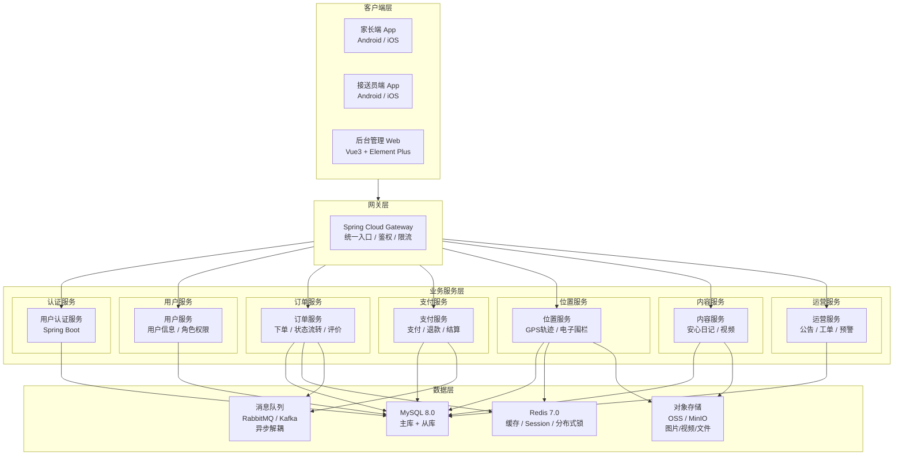

# 安心接送平台 — 数据库设计文档

---

> **项目名称**：安心接送 — 儿童安全接送服务平台  
> **文档类型**：数据库设计文档  
> **数据库**：MySQL 8.0+ (InnoDB, utf8mb4_unicode_ci)  
> **编制日期**：2026 年 4 月  
> **版本**：v1.0.0  
> **状态**：草稿

---

## 文档导航

本数据库设计文档已拆分为以下子文档，请按需查阅：

| 子文档 | 内容 | 说明 |
|--------|------|------|
| [00-概览与引言](00-概览与引言.md) | 目录、版本历史、引言、数据库设计概述 | 本文档 |
| [01-用户与认证模块](01-用户与认证模块.md) | 第3章：sys_user、sys_role、sys_permission 等 | RBAC 权限体系 |
| [02-家长端模块](02-家长端模块.md) | 第4章：parent_profile、child、wallet 等 | 家长/孩子/钱包 |
| [03-接送员端模块](03-接送员端模块.md) | 第5章：driver_profile、qualification、vehicle 等 | 接送员/资质/车辆 |
| [04-订单核心模块](04-订单核心模块.md) | 第6章：orders、order_child、order_review 等 | 订单/状态/评价 |
| [05-支付财务与位置轨迹模块](05-支付财务与位置轨迹模块.md) | 第7-8章：payment_record、trajectory_point 等 | 支付/退款/轨迹/围栏 |
| [06-内容社区与运营支撑模块](06-内容社区与运营支撑模块.md) | 第9-10章：peace_diary、work_order 等 | 日记/视频/工单/预警 |
| [07-索引设计与初始化数据](07-索引设计与初始化数据.md) | 第11-12章+附录 | 索引规范/初始数据/SQL 脚本 |

### ER 图

所有 ER 图（Mermaid 格式）集中存放在 [`er-diagrams/`](er-diagrams/README.md) 目录：

| ER 图 | 说明 |
|--------|------|
| [整体 ER 图](er-diagrams/00-整体ER图.md) | 全平台 42 张表跨模块关联 |
| [01-用户与认证](er-diagrams/01-用户与认证模块.md) | 用户/角色/权限/日志 |
| [02-家长端](er-diagrams/02-家长端模块.md) | 家长/孩子/钱包/会员 |
| [03-接送员端](er-diagrams/03-接送员端模块.md) | 接送员/资质/车辆/培训/保险 |
| [04-订单核心](er-diagrams/04-订单核心模块.md) | 订单/状态/评价/异常 |
| [05-支付财务](er-diagrams/05-支付财务模块.md) | 支付/退款/结算/提现 |
| [06-位置轨迹](er-diagrams/06-位置轨迹模块.md) | 轨迹点/围栏/围栏事件 |
| [07-内容社区](er-diagrams/07-内容社区模块.md) | 日记/视频/直播/IP孵化 |
| [08-运营支撑](er-diagrams/08-运营支撑模块.md) | 公告/工单/配置/预警/排行 |

---

## 目录

- [1. 引言](#1-引言)
  - [1.1 编写目的](#11-编写目的)
  - [1.2 读者对象](#12-读者对象)
  - [1.3 术语与缩略语](#13-术语与缩略语)
  - [1.4 参考资料](#14-参考资料)
- [2. 数据库设计概述](#2-数据库设计概述)
  - [2.1 设计原则](#21-设计原则)
  - [2.2 技术选型](#22-技术选型)
  - [2.3 命名规范](#23-命名规范)
  - [2.4 全局 ER 图](#24-全局-er-图)
  - [2.5 系统架构图](#25-系统架构图)
- [3. 用户与认证模块](01-用户与认证模块.md)
- [4. 家长端模块](02-家长端模块.md)
- [5. 接送员端模块](03-接送员端模块.md)
- [6. 订单核心模块](04-订单核心模块.md)
- [7-8. 支付财务与位置轨迹模块](05-支付财务与位置轨迹模块.md)
- [9-10. 内容社区与运营支撑模块](06-内容社区与运营支撑模块.md)
- [11-12. 索引设计与初始化数据](07-索引设计与初始化数据.md)

---

## 版本历史

| 版本 | 日期 | 修订人 | 修订内容 |
|------|------|--------|----------|
| v1.0.0 | 2026-04-13 | — | 初稿：文档结构搭建、全局 ER 图、全部表结构定义、SQL 脚本 |

---

## 1. 引言

### 1.1 编写目的

本文档定义"安心接送"平台后端数据库的完整设计方案，为后端开发人员提供统一的数据库建表、索引和约束规范，并为测试与运维提供参考依据。

### 1.2 读者对象

- 后端开发工程师
- 数据库管理员（DBA）
- 测试工程师
- 项目经理

### 1.3 术语与缩略语

| 缩略语 | 全称 | 说明 |
|--------|------|------|
| ER | Entity-Relationship | 实体关系图 |
| FK | Foreign Key | 外键 |
| PK | Primary Key | 主键 |
| UK | Unique Key | 唯一索引 |
| RBAC | Role-Based Access Control | 基于角色的访问控制 |

### 1.4 参考资料

- 《安心接送 — 家长端软件需求规格说明书》
- 《安心接送 — 接送员端软件需求规格说明书》
- 《安心接送 — 后台管理端软件需求规格说明书》
- MySQL 8.0 Reference Manual

---

## 2. 数据库设计概述

### 2.1 设计原则

1. **规范化与反规范化平衡**：核心事务表遵循第三范式，高频查询表适度冗余
2. **软删除优先**：业务数据采用逻辑删除（`is_deleted`），保留审计追溯
3. **时间戳标准**：所有表包含 `created_at`、`updated_at`，关键表附加 `deleted_at`
4. **金额精度**：所有金额字段使用 `DECIMAL(10,2)`，避免浮点误差
5. **字符集统一**：utf8mb4_unicode_ci，支持 emoji 和多语言

### 2.2 技术选型

| 项目 | 选型 |
|------|------|
| 数据库 | MySQL 8.0+ |
| 存储引擎 | InnoDB |
| 字符集 | utf8mb4 |
| 排序规则 | utf8mb4_unicode_ci |
| 时区 | Asia/Shanghai (UTC+8) |
| 部署方式 | 本地部署 + 内网穿透 |

### 2.3 命名规范

| 对象 | 规范 | 示例 |
|------|------|------|
| 表名 | snake_case，模块前缀 | `sys_user`, `ord_order` |
| 字段名 | snake_case | `user_id`, `created_at` |
| 主键 | `id` | `id BIGINT AUTO_INCREMENT` |
| 外键 | `fk_子表_父表_字段` | `fk_order_child_order_id` |
| 普通索引 | `idx_表名_字段` | `idx_orders_status` |
| 唯一索引 | `uk_表名_字段` | `uk_sys_user_phone` |
| 布尔字段 | `is_` 前缀 | `is_deleted`, `is_active` |
| 时间字段 | `_at` 后缀 | `created_at`, `updated_at` |
| 金额字段 | `DECIMAL(10,2)` | `total_amount` |

### 2.4 全局 ER 图

```mermaid
erDiagram
    sys_user {
        bigint id PK
        varchar phone "唯一登录账号"
        varchar password_hash "密码"
        tinyint user_type "1-家长 2-接送员 3-管理员"
        tinyint status "1-正常 2-禁用"
        datetime created_at
        datetime updated_at
        tinyint is_deleted "0-否 1-是"
    }

    sys_admin {
        bigint id PK
        bigint user_id FK "关联sys_user"
        varchar username "管理员账号"
        varchar nickname
        varchar email
        tinyint status
        datetime created_at
        datetime updated_at
    }

    sys_role {
        bigint id PK
        varchar role_code "DRIVER/PARENT/ADMIN"
        varchar role_name
        varchar description
        datetime created_at
    }

    sys_user_role {
        bigint id PK
        bigint user_id FK
        bigint role_id FK
        datetime created_at
    }

    sys_operation_log {
        bigint id PK
        bigint user_id FK
        varchar module
        varchar operation
        varchar method
        varchar ip
        text request_param
        text response_result
        tinyint status "1-成功 2-失败"
        varchar error_msg
        datetime created_at
    }

    parent_profile {
        bigint id PK
        bigint user_id FK "关联sys_user"
        varchar real_name
        varchar id_card
        varchar avatar_url
        varchar emergency_name
        varchar emergency_phone
        bigint member_level_id FK "关联member_level"
        decimal balance "钱包余额"
        datetime created_at
        datetime updated_at
    }

    child {
        bigint id PK
        bigint parent_id FK "关联parent_profile"
        varchar child_name
        varchar id_card
        varchar avatar_url
        varchar school_name
        varchar grade_class
        varchar pickup_code "接送码"
        varchar health_notes
        datetime created_at
        datetime updated_at
        tinyint is_deleted
    }

    driver_profile {
        bigint id PK
        bigint user_id FK "关联sys_user"
        varchar real_name
        varchar id_card
        varchar avatar_url
        tinyint gender
        varchar license_no "驾照号"
        date license_expire
        tinyint auth_status "0-未认证 1-认证中 2-已认证 3-认证失败"
        tinyint is_online "0-离线 1-在线"
        decimal rating "评分"
        datetime created_at
        datetime updated_at
    }

    vehicle {
        bigint id PK
        bigint driver_id FK "关联driver_profile"
        varchar plate_no "车牌号"
        varchar vehicle_type "SUV/面包车等"
        varchar brand_model
        varchar color
        varchar vin "车架号"
        varchar license_url
        tinyint is_default "是否为默认车辆"
        tinyint status "1-正常 2-审核中 3-禁用"
        datetime created_at
        datetime updated_at
    }

    qualification {
        bigint id PK
        bigint driver_id FK "关联driver_profile"
        tinyint type "1-身份证 2-驾驶证 3-行驶证 4-无犯罪记录 5-健康证明"
        tinyint status "0-待审核 1-通过 2-拒绝"
        varchar reject_reason
        datetime verified_at
        datetime created_at
    }

    orders {
        bigint id PK
        varchar order_no "订单号"
        bigint parent_id FK "关联parent_profile(下单家长)"
        bigint driver_id FK "关联driver_profile(接单接送员)"
        bigint vehicle_id FK "关联vehicle"
        smallint status "1-待支付 2-待确认 3-已确认 4-进行中 5-已完成 6-已取消 7-异常"
        decimal total_amount "总价"
        decimal discount_amount "优惠金额"
        decimal actual_amount "实付金额"
        varchar pickup_address
        decimal pickup_lat
        decimal pickup_lng
        varchar deliver_address
        decimal deliver_lat
        decimal deliver_lng
        datetime scheduled_time "预约时间"
        datetime actual_pickup_time "实际上车时间"
        datetime actual_complete_time "实际完成时间"
        varchar pickup_code "接送码"
        text remark
        datetime created_at
        datetime updated_at
        tinyint is_deleted
    }

    order_child {
        bigint id PK
        bigint order_id FK "关联orders"
        bigint child_id FK "关联child"
        datetime created_at
    }

    order_status_log {
        bigint id PK
        bigint order_id FK "关联orders"
        smallint status
        varchar status_desc
        bigint operator_id "操作人ID"
        varchar operator_type "PARENT/DRIVER/SYSTEM"
        text remark
        datetime created_at
    }

    order_review {
        bigint id PK
        bigint order_id FK "关联orders"
        bigint reviewer_id "评价人ID"
        varchar reviewer_type "PARENT/DRIVER"
        tinyint rating "1-5星"
        tinyint attitude_rating "服务态度评分"
        tinyint punctuality_rating "准时性评分"
        tinyint security_rating "安全性评分"
        text content
        json images "评价图片"
        datetime created_at
    }

    payment_record {
        bigint id PK
        varchar payment_no "支付单号"
        bigint order_id FK "关联orders"
        bigint payer_id FK "关联sys_user"
        decimal amount
        tinyint payment_method "1-微信 2-支付宝 3-余额"
        tinyint status "1-待支付 2-支付中 3-成功 4-失败"
        varchar transaction_no "第三方交易号"
        datetime paid_at
        datetime created_at
    }

    refund_record {
        bigint id PK
        varchar refund_no "退款单号"
        bigint payment_id FK "关联payment_record"
        bigint order_id FK "关联orders"
        bigint applicant_id FK "关联sys_user"
        decimal refund_amount
        tinyint reason_type "1-用户取消 2-系统取消 3-赔付"
        text reason
        tinyint status "0-待处理 1-同意 2-拒绝"
        varchar reject_reason
        datetime processed_at
        datetime created_at
    }

    wallet {
        bigint id PK
        bigint user_id FK "关联sys_user"
        decimal balance "余额"
        decimal frozen_amount "冻结金额"
        datetime updated_at
    }

    wallet_transaction {
        bigint id PK
        bigint wallet_id FK "关联wallet"
        tinyint type "1-充值 2-消费 3-退款 4-提现 5-奖励"
        decimal amount
        decimal balance_before "变动前余额"
        decimal balance_after "变动后余额"
        bigint related_order_id "关联订单ID"
        varchar description
        datetime created_at
    }

    member_level {
        bigint id PK
        varchar level_code "SILVER/GOLD/PLATINUM/DIAMOND"
        varchar level_name
        int min_points "最低积分"
        decimal discount_rate "折扣率"
        varchar benefits "权益描述"
        datetime created_at
    }

    coupon {
        bigint id PK
        bigint user_id FK "关联sys_user"
        varchar coupon_code
        tinyint type "1-满减 2-折扣 3-立减"
        decimal use_threshold "满X可用"
        decimal discount_value
        tinyint status "0-未使用 1-已使用 2-已过期 3-已禁用"
        datetime valid_from
        datetime valid_until
        datetime used_at
        bigint order_id FK "关联orders"
        datetime created_at
    }

    trajectory_point {
        bigint id PK
        bigint driver_id FK "关联driver_profile"
        bigint order_id FK "关联orders(可选)"
        decimal latitude
        decimal longitude
        float speed "km/h"
        float bearing "方向角"
        float accuracy "定位精度m"
        datetime recorded_at
    }

    geofence {
        bigint id PK
        varchar name "围栏名称"
        varchar type "SCHOOL/ROUTE/CUSTOM"
        json polygon "JSON多边形坐标"
        json center_point "中心点"
        float radius "半径(米)，圆型围栏用"
        tinyint status "1-启用 2-禁用"
        datetime created_at
    }

    geofence_event {
        bigint id PK
        bigint geofence_id FK "关联geofence"
        bigint driver_id FK "关联driver_profile"
        bigint order_id FK "关联orders"
        tinyint event_type "1-进入 2-离开"
        decimal latitude
        decimal longitude
        datetime event_time
    }

    peace_diary {
        bigint id PK
        bigint order_id FK "关联orders"
        bigint driver_id FK "关联driver_profile"
        bigint child_id FK "关联child"
        tinyint diary_type "1-文字 2-图片 3-视频"
        text content
        json media_urls "媒体文件URL列表"
        tinyint is_public "0-私密 1-公开"
        int like_count
        int comment_count
        datetime created_at
    }

    announcement {
        bigint id PK
        varchar title
        text content
        tinyint target_type "1-全体 2-家长 3-接送员"
        tinyint priority "1-低 2-中 3-高"
        tinyint status "1-草稿 2-已发布 3-已下线"
        datetime published_at
        datetime created_at
        bigint created_by FK "关联sys_admin"
    }

    work_order {
        bigint id PK
        varchar order_no "工单号"
        bigint user_id FK "关联sys_user"
        tinyint user_type "1-家长 2-接送员"
        tinyint type "1-投诉 2-建议 3-咨询 4-其他"
        varchar title
        text content
        json images
        tinyint status "1-待处理 2-处理中 3-已解决 4-已关闭"
        bigint handler_id FK "关联sys_admin"
        text handle_result
        datetime handled_at
        datetime created_at
        datetime updated_at
    }

    alert_record {
        bigint id PK
        bigint order_id FK "关联orders"
        bigint driver_id FK "关联driver_profile"
        bigint child_id FK "关联child"
        tinyint alert_type "1-超速 2-偏离路线 3-异常停留 4-紧急求助"
        tinyint severity "1-低 2-中 3-高 4-紧急"
        decimal latitude
        decimal longitude
        text alert_data "告警详情JSON"
        tinyint status "0-未读 1-已读 2-已处理"
        datetime handled_at
        datetime created_at
    }

    leaderboard {
        bigint id PK
        bigint driver_id FK "关联driver_profile"
        tinyint period_type "1-日 2-周 3-月"
        date period_start
        date period_end
        int rank
        int service_count "服务次数"
        decimal avg_rating "平均评分"
        int total_points "综合积分"
        datetime updated_at
    }

    sys_user ||--o{ sys_admin : "1:1扩展"
    sys_user ||--o{ parent_profile : "1:1扩展"
    sys_user ||--o{ driver_profile : "1:1扩展"
    sys_user ||--o{ wallet : "1:1"
    sys_user ||--o{ coupon : "1:N"
    sys_user ||--o{ sys_user_role : "1:N"
    sys_user ||--o{ sys_operation_log : "1:N操作日志"
    sys_user ||--o{ work_order : "1:N提交"
    sys_role ||--o{ sys_user_role : "1:N"
    parent_profile ||--o{ child : "1:N"
    parent_profile ||--o{ orders : "1:N下单"
    parent_profile ||--o{ peace_diary : "1:N"
    parent_profile ||--|| member_level : "N:1"
    child ||--o{ order_child : "1:N"
    child ||--o{ peace_diary : "1:N"
    driver_profile ||--o{ vehicle : "1:N"
    driver_profile ||--o{ qualification : "1:5"
    driver_profile ||--o{ orders : "1:N接单"
    driver_profile ||--o{ trajectory_point : "1:N轨迹"
    driver_profile ||--o{ geofence_event : "1:N"
    driver_profile ||--o{ peace_diary : "1:N"
    driver_profile ||--o{ alert_record : "1:N"
    driver_profile ||--o{ leaderboard : "1:N"
    orders ||--o{ order_child : "1:N"
    orders ||--o{ order_status_log : "1:N"
    orders ||--o{ order_review : "1:N"
    orders ||--o{ payment_record : "1:N"
    orders ||--o{ refund_record : "1:N"
    orders ||--o{ trajectory_point : "1:N"
    orders ||--o{ alert_record : "1:N"
    orders ||--o{ peace_diary : "1:N"
    orders ||--|| vehicle : "N:1"
    payment_record ||--o{ refund_record : "1:N"
    wallet ||--o{ wallet_transaction : "1:N"
    sys_admin ||--o{ announcement : "1:N"
    sys_admin ||--o{ work_order : "1:N处理"
    sys_admin ||--o{ alert_record : "1:N"
    geofence ||--o{ geofence_event : "1:N"
```

### 2.5 系统架构图

---

> **下一节**：[01-用户与认证模块](01-用户与认证模块.md)
