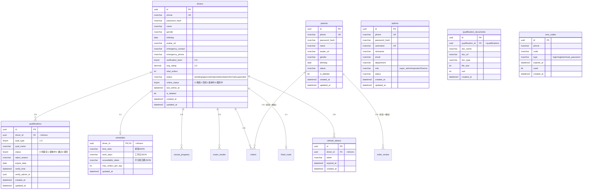

# 01-用户与认证模块

> **导航**：[数据库设计文档](数据库设计文档.md) | **用户与认证模块** | [家长端模块](02-家长端模块.md)

---

## 模块 ER 图

---

## 表结构

### 1.1 drivers — 接送员账户表

| 字段名 | 类型 | 约束 | 说明 |
|--------|------|------|------|
| id | UNIQUEIDENTIFIER | PK, DEFAULT NEWID() | 主键 |
| phone | NVARCHAR(20) | NOT NULL, UNIQUE | **独立手机号**（家长端同号不算同一人） |
| password_hash | NVARCHAR(255) | NOT NULL | bcrypt 加密密码 |
| name | NVARCHAR(100) | | 真实姓名 |
| gender | NVARCHAR(10) | | 性别 |
| birthday | DATE | | 出生日期 |
| avatar_url | NVARCHAR(500) | | 头像 URL |
| emergency_contact | NVARCHAR(100) | | 紧急联系人 |
| emergency_phone | NVARCHAR(20) | | 紧急联系电话 |
| verification_level | TINYINT | NOT NULL, DEFAULT 0 | 认证等级：0-未认证 1-基础 2-身份 3-驾照 4-车辆 5-完全 |
| avg_rating | DECIMAL(3,2) | NOT NULL, DEFAULT 0.00 | 平均评分 |
| total_orders | INT | NOT NULL, DEFAULT 0 | 完成订单总数 |
| status | NVARCHAR(20) | NOT NULL, DEFAULT N'pending' | pending-待审核 / approved-审核通过 / rejected-审核驳回 / probation-试用期 / formal-正式 / suspended-暂停 |
| online_status | TINYINT | NOT NULL, DEFAULT 0 | 0-离线 1-空闲 2-接单中 3-服务中 |
| last_online_at | DATETIME2 | | 最后上线时间 |
| is_deleted | BIT | NOT NULL, DEFAULT 0 | 软删除 |
| created_at | DATETIME2 | NOT NULL, DEFAULT GETDATE() | 创建时间 |
| updated_at | DATETIME2 | NOT NULL, DEFAULT GETDATE() | 更新时间 |

**索引**：
- `uk_drivers_phone` (phone)
- `idx_drivers_status` (status)
- `idx_drivers_online_status` (online_status)

**说明**：家长端和接送员端各自独立，同手机号不算同一人。ViaKidServer JWT 中直接含 driver_id，无需关联 sys_user。

---

### 1.2 parents — 家长账户表

| 字段名 | 类型 | 约束 | 说明 |
|--------|------|------|------|
| id | UNIQUEIDENTIFIER | PK, DEFAULT NEWID() | 主键 |
| phone | NVARCHAR(20) | NOT NULL, UNIQUE | **独立手机号** |
| password_hash | NVARCHAR(255) | NOT NULL | bcrypt 加密密码 |
| name | NVARCHAR(100) | | 姓名 |
| avatar_url | NVARCHAR(500) | | 头像 URL |
| gender | NVARCHAR(10) | | 性别 |
| birthday | DATE | | 出生日期 |
| status | NVARCHAR(20) | NOT NULL, DEFAULT N'active' | 状态 |
| is_deleted | BIT | NOT NULL, DEFAULT 0 | 软删除 |
| created_at | DATETIME2 | NOT NULL, DEFAULT GETDATE() | 创建时间 |
| updated_at | DATETIME2 | NOT NULL, DEFAULT GETDATE() | 更新时间 |

**索引**：`uk_parents_phone` (phone)

**说明**：阶段一为空壳，orders.parent_id 使用模拟 UUID，家长端接入时再完善本表。

---

### 1.3 admins — 管理员账户表

| 字段名 | 类型 | 约束 | 说明 |
|--------|------|------|------|
| id | UNIQUEIDENTIFIER | PK, DEFAULT NEWID() | 主键 |
| phone | NVARCHAR(20) | NOT NULL, UNIQUE | **独立手机号** |
| password_hash | NVARCHAR(255) | NOT NULL | bcrypt 加密密码 |
| username | NVARCHAR(50) | NOT NULL, UNIQUE | 管理员登录名 |
| nickname | NVARCHAR(100) | | 显示昵称 |
| email | NVARCHAR(100) | | 邮箱 |
| department | NVARCHAR(100) | | 所属部门 |
| role | NVARCHAR(50) | NOT NULL, DEFAULT N'staff' | super_admin-超级管理员 / operator-运营 / finance-财务 |
| status | NVARCHAR(20) | NOT NULL, DEFAULT N'active' | 状态 |
| created_at | DATETIME2 | NOT NULL, DEFAULT GETDATE() | 创建时间 |
| updated_at | DATETIME2 | NOT NULL, DEFAULT GETDATE() | 更新时间 |

**索引**：`uk_admins_phone` (phone), `uk_admins_username` (username)

**说明**：暂不接入管理后台 API，先建好表结构。管理员认证体系（RBAC 角色权限）本次不实现。

---

### 1.4 qualifications — 五重资质认证表

| 字段名 | 类型 | 约束 | 说明 |
|--------|------|------|------|
| id | UNIQUEIDENTIFIER | PK, DEFAULT NEWID() | 主键 |
| driver_id | UNIQUEIDENTIFIER | NOT NULL, FK(drivers.id) | 关联接送员 |
| qual_type | TINYINT | NOT NULL | 1-身份证 2-驾驶证 3-行驶证 4-无犯罪记录 5-健康证明 |
| qual_name | NVARCHAR(50) | NOT NULL | 资质名称 |
| status | TINYINT | NOT NULL, DEFAULT 0 | 0-待提交 1-审核中 2-审核通过 3-审核驳回 |
| reject_reason | NVARCHAR(255) | | 驳回原因 |
| expire_date | DATE | | 资质到期日 |
| verify_time | DATETIME2 | | 审核通过时间 |
| verify_admin_id | UNIQUEIDENTIFIER | | 审核管理员 ID |
| created_at | DATETIME2 | NOT NULL, DEFAULT GETDATE() | 创建时间 |
| updated_at | DATETIME2 | NOT NULL, DEFAULT GETDATE() | 更新时间 |

**索引**：`uk_qualifications_driver_type` (driver_id, qual_type)

**说明**：由原 `certifications` 表重构而来，拆分出独立的 `qualification_documents` 子表存储材料文件。

---

### 1.5 qualification_documents — 资质材料表

| 字段名 | 类型 | 约束 | 说明 |
|--------|------|------|------|
| id | UNIQUEIDENTIFIER | PK, DEFAULT NEWID() | 主键 |
| qualification_id | UNIQUEIDENTIFIER | NOT NULL, FK(qualifications.id) | 关联资质认证 |
| doc_name | NVARCHAR(100) | NOT NULL | 材料名称（如：身份证正面） |
| doc_url | NVARCHAR(500) | NOT NULL | 材料文件 URL |
| doc_type | NVARCHAR(20) | NOT NULL | IMAGE / PDF / VIDEO |
| file_size | INT | | 文件大小（字节） |
| sort | INT | NOT NULL, DEFAULT 0 | 排序 |
| created_at | DATETIME2 | NOT NULL, DEFAULT GETDATE() | 创建时间 |

**索引**：`idx_qualification_documents_qual_id` (qualification_id)

---

### 1.6 schedules — 排班表

| 字段名 | 类型 | 约束 | 说明 |
|--------|------|------|------|
| driver_id | UNIQUEIDENTIFIER | PK, FK(drivers.id) | 关联接送员 |
| time_slots | NVARCHAR(MAX) | | JSON 排班数据 |
| work_days | NVARCHAR(MAX) | | JSON 工作日数组 |
| unavailable_dates | NVARCHAR(MAX) | | JSON 不可用日期数组 |
| max_orders_per_day | INT | NOT NULL, DEFAULT 5 | 当日最大接单数 |
| updated_at | DATETIME2 | NOT NULL, DEFAULT GETDATE() | 更新时间 |

---

### 1.7 sms_codes — 短信验证码表

| 字段名 | 类型 | 约束 | 说明 |
|--------|------|------|------|
| id | UNIQUEIDENTIFIER | PK, DEFAULT NEWID() | 主键 |
| phone | NVARCHAR(20) | NOT NULL | 接收手机号 |
| code | NVARCHAR(10) | NOT NULL | 6 位验证码 |
| type | NVARCHAR(20) | | login-登录 / register-注册 / reset_password-改密 |
| expired_at | DATETIME2 | NOT NULL | 过期时间（默认 5 分钟） |
| used | BIT | NOT NULL, DEFAULT 0 | 是否已使用 |
| created_at | DATETIME2 | NOT NULL, DEFAULT GETDATE() | 创建时间 |

**索引**：`idx_sms_codes_phone_expired` (phone, expired_at)

---

### 1.8 refresh_tokens — 刷新令牌表

| 字段名 | 类型 | 约束 | 说明 |
|--------|------|------|------|
| id | UNIQUEIDENTIFIER | PK, DEFAULT NEWID() | 主键 |
| driver_id | UNIQUEIDENTIFIER | NOT NULL, FK(drivers.id) | 关联接送员 |
| token | NVARCHAR(500) | NOT NULL, UNIQUE | JWT 刷新令牌 |
| expired_at | DATETIME2 | NOT NULL | 过期时间 |
| created_at | DATETIME2 | NOT NULL, DEFAULT GETDATE() | 创建时间 |

**索引**：`uk_refresh_tokens_token` (token)

---

> **上一节**：[数据库设计文档](数据库设计文档.md) | **下一节**：[家长端模块](02-家长端模块.md)
