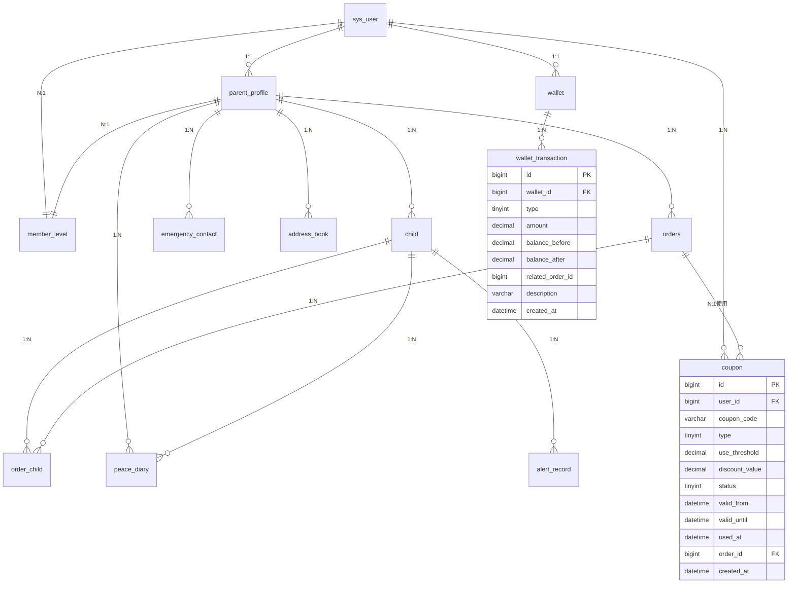

# 4. 家长端模块

> **导航**：[用户与认证模块](01-用户与认证模块.md) | **家长端模块** | [接送员端模块](03-接送员端模块.md)

---

### 4.1 模块 ER 图

### 4.2 表结构

#### 4.2.1 parent_profile — 家长扩展信息表

| 字段名 | 类型 | 约束 | 说明 |
|--------|------|------|------|
| id | BIGINT | PK, AUTO_INCREMENT | 主键 |
| user_id | BIGINT | NOT NULL, UNIQUE, FK(sys_user.id) | 关联 sys_user |
| real_name | VARCHAR(50) | NOT NULL | 真实姓名 |
| id_card | VARCHAR(20) | | 身份证号 |
| avatar_url | VARCHAR(512) | | 头像 URL |
| gender | TINYINT | | 0-未知 1-男 2-女 |
| birthday | DATE | | 生日 |
| emergency_name | VARCHAR(50) | | 紧急联系人姓名 |
| emergency_phone | VARCHAR(20) | | 紧急联系人电话 |
| emergency_relation | VARCHAR(20) | | 与紧急联系人的关系 |
| member_level_id | BIGINT | FK(member_level.id) | 会员等级 |
| total_points | INT | DEFAULT 0 | 累计积分 |
| available_points | INT | DEFAULT 0 | 可用积分 |
| created_at | DATETIME | NOT NULL, DEFAULT CURRENT_TIMESTAMP | 创建时间 |
| updated_at | DATETIME | NOT NULL, DEFAULT CURRENT_TIMESTAMP ON UPDATE | 更新时间 |

**索引**：`idx_parent_profile_user_id` (user_id)

---

#### 4.2.2 child — 孩子档案表

| 字段名 | 类型 | 约束 | 说明 |
|--------|------|------|------|
| id | BIGINT | PK, AUTO_INCREMENT | 主键 |
| parent_id | BIGINT | NOT NULL, FK(parent_profile.id) | 关联家长 |
| child_name | VARCHAR(50) | NOT NULL | 孩子姓名 |
| id_card | VARCHAR(20) | | 身份证号（便于实名认证） |
| gender | TINYINT | NOT NULL | 0-未知 1-男 2-女 |
| birthday | DATE | | 出生日期 |
| avatar_url | VARCHAR(512) | | 头像 URL |
| school_name | VARCHAR(100) | | 学校名称 |
| grade | VARCHAR(20) | | 年级 |
| class_name | VARCHAR(20) | | 班级 |
| pickup_code | VARCHAR(10) | NOT NULL, UNIQUE | 接送码（4-6位随机码） |
| health_notes | TEXT | | 健康备注（过敏/疾病等） |
| height_cm | DECIMAL(5,1) | | 身高（cm） |
| weight_kg | DECIMAL(4,1) | | 体重（kg） |
| photo_url | VARCHAR(512) | | 孩子照片 URL（备用接送用） |
| is_deleted | TINYINT | NOT NULL, DEFAULT 0 | 0-未删除 1-已删除 |
| created_at | DATETIME | NOT NULL, DEFAULT CURRENT_TIMESTAMP | 创建时间 |
| updated_at | DATETIME | NOT NULL, DEFAULT CURRENT_TIMESTAMP ON UPDATE | 更新时间 |
| deleted_at | DATETIME | | 逻辑删除时间 |

**索引**：`idx_child_parent_id` (parent_id), `idx_child_pickup_code` (pickup_code)

---

#### 4.2.3 emergency_contact — 紧急联系人表

| 字段名 | 类型 | 约束 | 说明 |
|--------|------|------|------|
| id | BIGINT | PK, AUTO_INCREMENT | 主键 |
| parent_id | BIGINT | NOT NULL, FK(parent_profile.id) | 关联家长 |
| contact_name | VARCHAR(50) | NOT NULL | 联系人姓名 |
| contact_phone | VARCHAR(20) | NOT NULL | 联系人电话 |
| contact_relation | VARCHAR(20) | NOT NULL | 与孩子关系 |
| is_default | TINYINT | DEFAULT 0 | 是否为默认联系人 |
| created_at | DATETIME | NOT NULL, DEFAULT CURRENT_TIMESTAMP | 创建时间 |

**索引**：`idx_emergency_contact_parent_id` (parent_id)

---

#### 4.2.4 address_book — 常用地址簿表

| 字段名 | 类型 | 约束 | 说明 |
|--------|------|------|------|
| id | BIGINT | PK, AUTO_INCREMENT | 主键 |
| parent_id | BIGINT | NOT NULL, FK(parent_profile.id) | 关联家长 |
| address_name | VARCHAR(50) | NOT NULL | 地址名称（如：家、学校） |
| address_type | TINYINT | NOT NULL | 1-家 2-学校 3-公司 4-其他 |
| full_address | VARCHAR(255) | NOT NULL | 详细地址 |
| latitude | DECIMAL(10,6) | NOT NULL | 纬度 |
| longitude | DECIMAL(10,6) | NOT NULL | 经度 |
| contact_name | VARCHAR(50) | | 联系人姓名 |
| contact_phone | VARCHAR(20) | | 联系人电话 |
| is_default | TINYINT | DEFAULT 0 | 是否为默认地址 |
| created_at | DATETIME | NOT NULL, DEFAULT CURRENT_TIMESTAMP | 创建时间 |
| updated_at | DATETIME | NOT NULL, DEFAULT CURRENT_TIMESTAMP ON UPDATE | 更新时间 |

**索引**：`idx_address_book_parent_id` (parent_id)

---

#### 4.2.5 wallet — 钱包表

| 字段名 | 类型 | 约束 | 说明 |
|--------|------|------|------|
| id | BIGINT | PK, AUTO_INCREMENT | 主键 |
| user_id | BIGINT | NOT NULL, UNIQUE, FK(sys_user.id) | 关联 sys_user |
| balance | DECIMAL(12,2) | NOT NULL, DEFAULT 0.00 | 余额 |
| frozen_amount | DECIMAL(12,2) | NOT NULL, DEFAULT 0.00 | 冻结金额（提现中等） |
| total_recharge | DECIMAL(12,2) | NOT NULL, DEFAULT 0.00 | 累计充值 |
| total_consume | DECIMAL(12,2) | NOT NULL, DEFAULT 0.00 | 累计消费 |
| password | VARCHAR(255) | | 支付密码（独立于登录密码） |
| updated_at | DATETIME | NOT NULL, DEFAULT CURRENT_TIMESTAMP ON UPDATE | 更新时间 |

---

#### 4.2.6 wallet_transaction — 钱包流水表

| 字段名 | 类型 | 约束 | 说明 |
|--------|------|------|------|
| id | BIGINT | PK, AUTO_INCREMENT | 主键 |
| wallet_id | BIGINT | NOT NULL, FK(wallet.id) | 关联钱包 |
| type | TINYINT | NOT NULL | 1-充值 2-消费 3-退款 4-提现 5-奖励 |
| amount | DECIMAL(12,2) | NOT NULL | 变动金额（正负） |
| balance_before | DECIMAL(12,2) | NOT NULL | 变动前余额 |
| balance_after | DECIMAL(12,2) | NOT NULL | 变动后余额 |
| related_order_id | BIGINT | FK(orders.id) | 关联订单 ID |
| related_payment_id | BIGINT | | 关联支付记录 ID |
| description | VARCHAR(255) | | 流水描述 |
| extend_json | JSON | | 扩展数据 |
| created_at | DATETIME | NOT NULL, DEFAULT CURRENT_TIMESTAMP | 创建时间 |

**索引**：`idx_wallet_tx_wallet_id` (wallet_id), `idx_wallet_tx_created_at` (created_at), `idx_wallet_tx_type` (type)

---

#### 4.2.7 member_level — 会员等级表

| 字段名 | 类型 | 约束 | 说明 |
|--------|------|------|------|
| id | BIGINT | PK, AUTO_INCREMENT | 主键 |
| level_code | VARCHAR(20) | NOT NULL, UNIQUE | 等级代码：SILVER/GOLD/PLATINUM/DIAMOND |
| level_name | VARCHAR(50) | NOT NULL | 等级名称 |
| level_icon | VARCHAR(255) | | 等级图标 URL |
| min_points | INT | NOT NULL, DEFAULT 0 | 最低积分门槛 |
| max_points | INT | | 最高积分门槛（NULL 表示无上限） |
| discount_rate | DECIMAL(4,2) | DEFAULT 1.00 | 折扣率（如 0.95 表示 95 折） |
| points_rate | DECIMAL(3,2) | DEFAULT 1.00 | 积分倍率（消费 1 元得 X 积分） |
| benefits | TEXT | | 权益描述 JSON |
| sort | INT | DEFAULT 0 | 排序 |
| status | TINYINT | NOT NULL, DEFAULT 1 | 1-启用 2-禁用 |
| created_at | DATETIME | NOT NULL, DEFAULT CURRENT_TIMESTAMP | 创建时间 |

---

#### 4.2.8 coupon — 优惠券表

| 字段名 | 类型 | 约束 | 说明 |
|--------|------|------|------|
| id | BIGINT | PK, AUTO_INCREMENT | 主键 |
| user_id | BIGINT | NOT NULL, FK(sys_user.id) | 归属用户 |
| coupon_code | VARCHAR(50) | NOT NULL, UNIQUE | 优惠券码 |
| name | VARCHAR(100) | NOT NULL | 优惠券名称 |
| type | TINYINT | NOT NULL | 1-满减券 2-折扣券 3-立减券 |
| use_threshold | DECIMAL(10,2) | | 满 X 元可用，NULL 表示无门槛 |
| discount_value | DECIMAL(10,2) | NOT NULL | 优惠值（满减金额或折扣率） |
| max_discount_amount | DECIMAL(10,2) | | 最高优惠金额（折扣券上限） |
| valid_from | DATETIME | NOT NULL | 生效时间 |
| valid_until | DATETIME | NOT NULL | 过期时间 |
| status | TINYINT | NOT NULL, DEFAULT 0 | 0-未使用 1-已使用 2-已过期 3-已禁用 |
| used_at | DATETIME | | 使用时间 |
| order_id | BIGINT | FK(orders.id) | 关联使用订单 |
| source | VARCHAR(50) | | 来源：REGISTER/ORDER/ACTIVITY/GIFT |
| created_at | DATETIME | NOT NULL, DEFAULT CURRENT_TIMESTAMP | 创建时间 |

**索引**：`idx_coupon_user_id` (user_id), `idx_coupon_status` (status), `idx_coupon_valid_until` (valid_until)

---

> **上一节**：[用户与认证模块](01-用户与认证模块.md) | **下一节**：[接送员端模块](03-接送员端模块.md)
