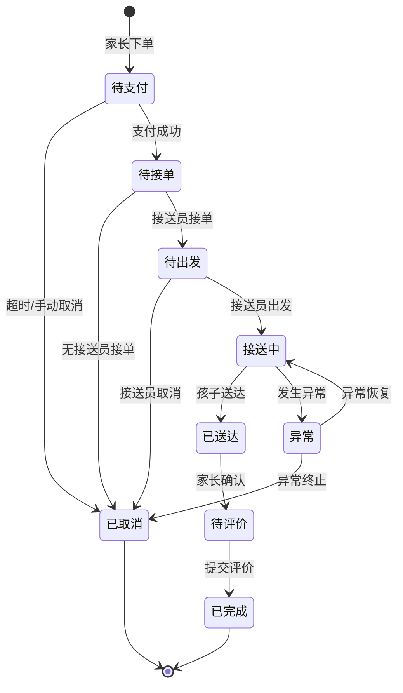
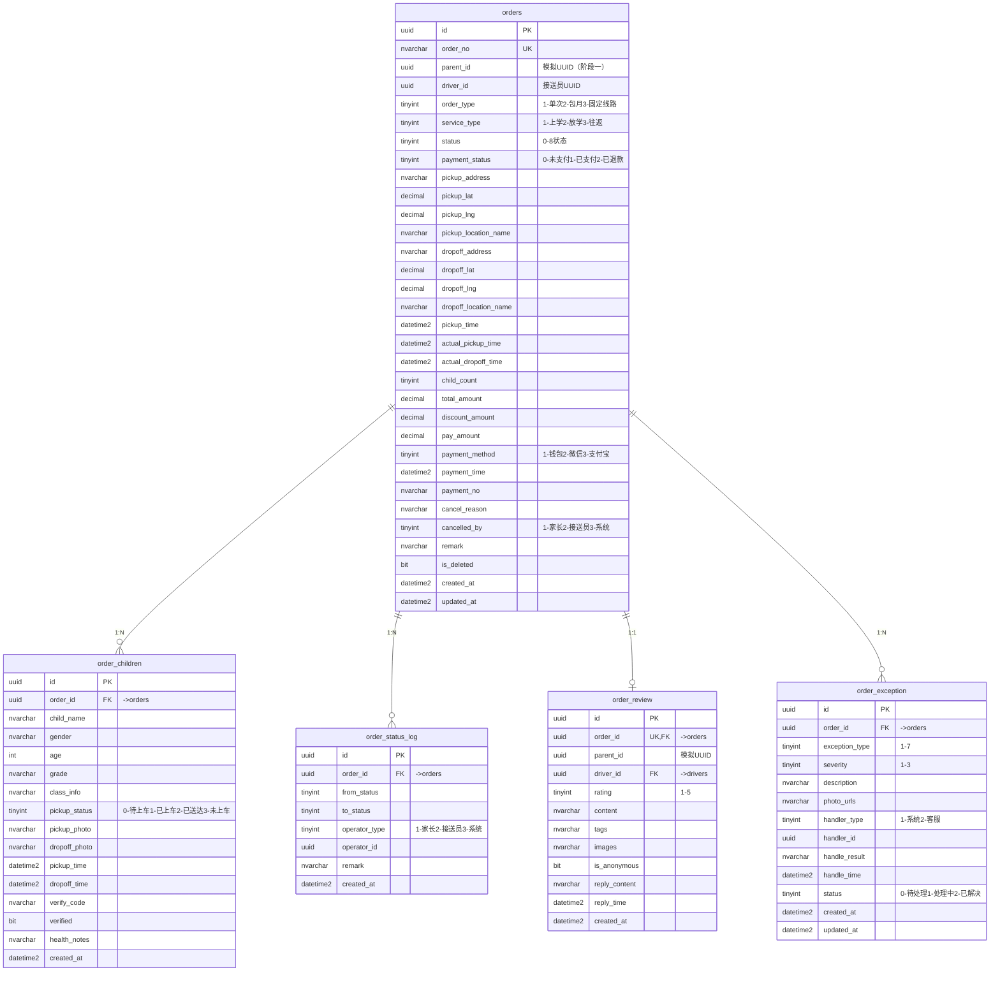

# 04-订单核心模块

> **导航**：[接送员端模块](03-接送员端模块.md) | **订单核心模块** | [支付财务与位置轨迹模块](05-支付财务与位置轨迹模块.md)

---

## 订单状态流转图

---

## 模块 ER 图

---

## 表结构

### 4.1 orders — 订单主表

| 字段名 | 类型 | 约束 | 说明 |
|--------|------|------|------|
| id | UNIQUEIDENTIFIER | PK, DEFAULT NEWID() | 主键 |
| order_no | NVARCHAR(32) | NOT NULL, UNIQUE | 订单编号，如 VX20260422001 |
| parent_id | UNIQUEIDENTIFIER | NULL | **阶段一为模拟 UUID**，家长端接入后改为真实引用 |
| driver_id | UNIQUEIDENTIFIER | NULL, FK(drivers.id) | 接单接送员，NULL 表示待抢单 |
| order_type | TINYINT | NOT NULL, DEFAULT 1 | 1-单次接送 2-包月套餐 3-固定线路 |
| service_type | TINYINT | NOT NULL, DEFAULT 1 | 1-上学接送 2-放学接送 3-往返接送 |
| status | TINYINT | NOT NULL, DEFAULT 0 | 0-待支付 1-待接单 2-待出发 3-接送中 4-已送达 5-待评价 6-已完成 7-已取消 8-异常 |
| payment_status | TINYINT | NOT NULL, DEFAULT 0 | 0-未支付 1-已支付 2-已退款 |
| pickup_address | NVARCHAR(255) | NOT NULL | 上车地址 |
| pickup_lat | DECIMAL(10,6) | NOT NULL | 上车纬度 |
| pickup_lng | DECIMAL(10,6) | NOT NULL | 上车经度 |
| pickup_location_name | NVARCHAR(200) | | 上车地点名称（可选） |
| dropoff_address | NVARCHAR(255) | NOT NULL | 下车地址 |
| dropoff_lat | DECIMAL(10,6) | NOT NULL | 下车纬度 |
| dropoff_lng | DECIMAL(10,6) | NOT NULL | 下车经度 |
| dropoff_location_name | NVARCHAR(200) | | 下车地点名称（可选） |
| pickup_time | DATETIME2 | NOT NULL | 预约接送时间 |
| actual_pickup_time | DATETIME2 | | 实际上车时间 |
| actual_dropoff_time | DATETIME2 | | 实际送达时间 |
| child_count | TINYINT | NOT NULL, DEFAULT 1 | 接送孩子数量 |
| total_amount | DECIMAL(10,2) | NOT NULL | 订单总金额 |
| discount_amount | DECIMAL(10,2) | NOT NULL, DEFAULT 0.00 | 优惠金额 |
| pay_amount | DECIMAL(10,2) | NOT NULL | 实付金额 |
| payment_method | TINYINT | | 1-钱包余额 2-微信支付 3-支付宝 |
| payment_time | DATETIME2 | | 支付时间 |
| payment_no | NVARCHAR(64) | | 第三方支付流水号 |
| cancel_reason | NVARCHAR(255) | | 取消原因 |
| cancelled_by | TINYINT | | 取消人：1-家长 2-接送员 3-系统 |
| remark | NVARCHAR(500) | | 订单备注 |
| is_deleted | BIT | NOT NULL, DEFAULT 0 | 软删除 |
| created_at | DATETIME2 | NOT NULL, DEFAULT GETDATE() | 创建时间 |
| updated_at | DATETIME2 | NOT NULL, DEFAULT GETDATE() | 更新时间 |

**索引**：
- `uk_orders_order_no` (order_no)
- `idx_orders_parent` (parent_id)
- `idx_orders_driver` (driver_id)
- `idx_orders_status` (status)
- `idx_orders_pickup_time` (pickup_time)
- `idx_orders_driver_status_date` (driver_id, status, pickup_time)

**说明**：新增 `payment_status` 字段（0-未支付 / 1-已支付 / 2-已退款），支付后续补。

---

### 4.2 order_children — 订单孩子关联表

| 字段名 | 类型 | 约束 | 说明 |
|--------|------|------|------|
| id | UNIQUEIDENTIFIER | PK, DEFAULT NEWID() | 主键 |
| order_id | UNIQUEIDENTIFIER | NOT NULL, FK(orders.id) | 关联订单 |
| child_name | NVARCHAR(100) | NOT NULL | 孩子姓名 |
| gender | NVARCHAR(10) | | 性别 |
| age | INT | | 年龄 |
| grade | NVARCHAR(50) | | 年级 |
| class_info | NVARCHAR(50) | | 班级 |
| pickup_status | TINYINT | NOT NULL, DEFAULT 0 | 0-待上车 1-已上车 2-已送达 3-未上车 |
| pickup_photo | NVARCHAR(500) | | 上车照片 URL |
| dropoff_photo | NVARCHAR(500) | | 送达照片 URL |
| pickup_time | DATETIME2 | | 实际上车时间 |
| dropoff_time | DATETIME2 | | 实际送达时间 |
| verify_code | NVARCHAR(6) | | 接送验证码（家长确认） |
| verified | BIT | NOT NULL, DEFAULT 0 | 是否已验证 |
| health_notes | NVARCHAR(MAX) | | 健康备注（过敏/疾病等） |
| created_at | DATETIME2 | NOT NULL, DEFAULT GETDATE() | 创建时间 |

**索引**：`idx_order_children_order` (order_id)

---

### 4.3 order_status_log — 订单状态流转记录表

| 字段名 | 类型 | 约束 | 说明 |
|--------|------|------|------|
| id | UNIQUEIDENTIFIER | PK, DEFAULT NEWID() | 主键 |
| order_id | UNIQUEIDENTIFIER | NOT NULL, FK(orders.id) | 关联订单 |
| from_status | TINYINT | | 原状态（NULL 表示初始创建） |
| to_status | TINYINT | NOT NULL | 新状态 |
| operator_type | TINYINT | NOT NULL | 1-家长 2-接送员 3-系统 |
| operator_id | UNIQUEIDENTIFIER | | 操作人 ID（家长/接送员 UUID） |
| remark | NVARCHAR(255) | | 操作备注 |
| created_at | DATETIME2 | NOT NULL, DEFAULT GETDATE() | 创建时间 |

**索引**：`idx_order_status_log_order` (order_id)

---

### 4.4 order_review — 订单评价表

| 字段名 | 类型 | 约束 | 说明 |
|--------|------|------|------|
| id | UNIQUEIDENTIFIER | PK, DEFAULT NEWID() | 主键 |
| order_id | UNIQUEIDENTIFIER | NOT NULL, UNIQUE, FK(orders.id) | 关联订单 |
| parent_id | UNIQUEIDENTIFIER | NULL | **阶段一为模拟 UUID**，家长端接入后改为真实引用 |
| driver_id | UNIQUEIDENTIFIER | NOT NULL, FK(drivers.id) | 被评价接送员 |
| rating | TINYINT | NOT NULL | 评分 1-5 |
| content | NVARCHAR(500) | | 评价内容 |
| tags | NVARCHAR(255) | | 标签：准时/安全/耐心/整洁 等 |
| images | NVARCHAR(1000) | | 评价图片 URL，多张逗号分隔 |
| is_anonymous | BIT | NOT NULL, DEFAULT 0 | 是否匿名评价 |
| reply_content | NVARCHAR(500) | | 接送员回复内容 |
| reply_time | DATETIME2 | | 接送员回复时间 |
| created_at | DATETIME2 | NOT NULL, DEFAULT GETDATE() | 创建时间 |

**索引**：`idx_order_review_driver` (driver_id)

---

### 4.5 order_exception — 订单异常记录表

| 字段名 | 类型 | 约束 | 说明 |
|--------|------|------|------|
| id | UNIQUEIDENTIFIER | PK, DEFAULT NEWID() | 主键 |
| order_id | UNIQUEIDENTIFIER | NOT NULL, FK(orders.id) | 关联订单 |
| exception_type | TINYINT | NOT NULL | 1-接送员迟到 2-孩子未出现 3-交通拥堵 4-车辆故障 5-天气异常 6-家长未到 7-其他 |
| severity | TINYINT | NOT NULL | 1-轻微 2-一般 3-严重 |
| description | NVARCHAR(500) | NOT NULL | 异常描述 |
| photo_urls | NVARCHAR(1000) | | 现场照片 URL |
| handler_type | TINYINT | | 1-系统自动处理 2-客服人工介入 |
| handler_id | UNIQUEIDENTIFIER | | 处理人 ID（客服 UUID） |
| handle_result | NVARCHAR(500) | | 处理结果 |
| handle_time | DATETIME2 | | 处理时间 |
| status | TINYINT | NOT NULL, DEFAULT 0 | 0-待处理 1-处理中 2-已解决 |
| created_at | DATETIME2 | NOT NULL, DEFAULT GETDATE() | 创建时间 |
| updated_at | DATETIME2 | NOT NULL, DEFAULT GETDATE() | 更新时间 |

**索引**：`idx_order_exception_order` (order_id)，`idx_order_exception_status` (status)

---

> **上一节**：[接送员端模块](03-接送员端模块.md) | **下一节**：[支付财务与位置轨迹模块](05-支付财务与位置轨迹模块.md)
