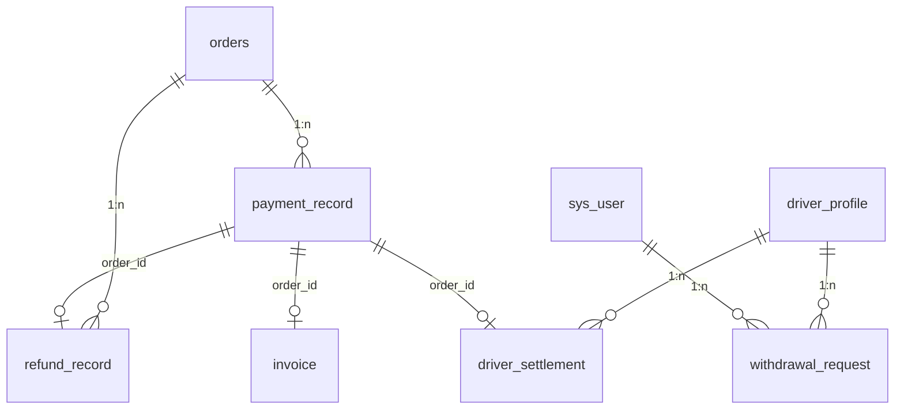
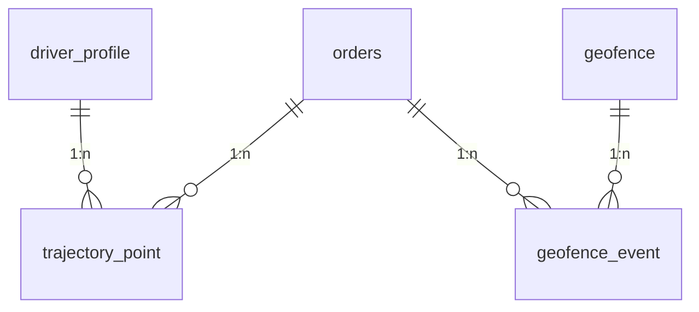

# 7-8. 支付财务与位置轨迹模块

> **导航**：[订单核心模块](04-订单核心模块.md) | **支付财务与位置轨迹模块** | [内容社区与运营支撑模块](06-内容社区与运营支撑模块.md)

---

## 7. 支付财务模块

### 7.1 模块 ER 图

### 7.2 表结构

#### 7.2.1 payment_record — 支付记录表

| 字段名 | 类型 | 约束 | 说明 |
|--------|------|------|------|
| id | BIGINT | PK, AUTO_INCREMENT | 主键 |
| order_id | BIGINT | NOT NULL, FK(orders.id) | 关联订单 |
| parent_id | BIGINT | NOT NULL, FK(sys_user.id) | 支付方家长 |
| driver_id | BIGINT | FK(sys_user.id) | 收款接送员（可为空） |
| amount | DECIMAL(10,2) | NOT NULL | 支付金额（元） |
| discount_amount | DECIMAL(10,2) | NOT NULL, DEFAULT 0.00 | 优惠金额 |
| actual_amount | DECIMAL(10,2) | NOT NULL | 实付金额 |
| coupon_id | BIGINT | FK(coupon.id) | 使用的优惠券 |
| payment_method | TINYINT | NOT NULL | 1-微信支付 2-支付宝 3-钱包余额 |
| transaction_id | VARCHAR(64) | | 第三方支付流水号 |
| trade_type | TINYINT | NOT NULL | 1-即时支付 2-担保交易 |
| status | TINYINT | NOT NULL, DEFAULT 0 | 0-待支付 1-支付中 2-已支付 3-已退款 |
| paid_at | DATETIME | | 支付时间 |
| created_at | DATETIME | NOT NULL, DEFAULT CURRENT_TIMESTAMP | 创建时间 |
| updated_at | DATETIME | NOT NULL, DEFAULT CURRENT_TIMESTAMP ON UPDATE | 更新时间 |

**索引**：`uk_payment_record_order_id` (order_id), `idx_payment_record_parent_id` (parent_id), `idx_payment_record_transaction_id` (transaction_id), `idx_payment_record_paid_at` (paid_at)

---

#### 7.2.2 refund_record — 退款记录表

| 字段名 | 类型 | 约束 | 说明 |
|--------|------|------|------|
| id | BIGINT | PK, AUTO_INCREMENT | 主键 |
| order_id | BIGINT | NOT NULL, FK(orders.id) | 关联订单 |
| payment_id | BIGINT | NOT NULL, FK(payment_record.id) | 原支付记录 |
| parent_id | BIGINT | NOT NULL, FK(sys_user.id) | 退款接收方 |
| refund_amount | DECIMAL(10,2) | NOT NULL | 退款金额 |
| refund_type | TINYINT | NOT NULL | 1-用户主动取消 2-系统取消 3-客服退款 |
| reason | VARCHAR(500) | NOT NULL | 退款原因 |
| reject_reason | VARCHAR(500) | | 驳回原因（客服人工退款时） |
| status | TINYINT | NOT NULL, DEFAULT 0 | 0-待审核 1-审核通过 2-审核驳回 3-退款中 4-已退款 5-退款失败 |
| handler_id | BIGINT | FK(sys_user.id) | 处理人（客服） |
| handled_at | DATETIME | | 处理时间 |
| refund_at | DATETIME | | 退款到账时间 |
| created_at | DATETIME | NOT NULL, DEFAULT CURRENT_TIMESTAMP | 创建时间 |
| updated_at | DATETIME | NOT NULL, DEFAULT CURRENT_TIMESTAMP ON UPDATE | 更新时间 |

**索引**：`idx_refund_record_order_id` (order_id), `idx_refund_record_parent_id` (parent_id), `idx_refund_record_status` (status)

---

#### 7.2.3 invoice — 发票表

| 字段名 | 类型 | 约束 | 说明 |
|--------|------|------|------|
| id | BIGINT | PK, AUTO_INCREMENT | 主键 |
| order_id | BIGINT | FK(orders.id) | 关联订单（非必须整单开票） |
| parent_id | BIGINT | NOT NULL, FK(sys_user.id) | 申请家长 |
| invoice_type | TINYINT | NOT NULL | 1-普通电子发票 2-增值税专用发票 3-增值税普通发票 |
| title_type | TINYINT | NOT NULL | 1-个人 2-企业 |
| title_name | VARCHAR(200) | NOT NULL | 发票抬头 |
| tax_number | VARCHAR(50) | | 税号（企业时必填） |
| registered_address | VARCHAR(500) | | 注册地址（专票时填） |
| registered_phone | VARCHAR(20) | | 注册电话（专票时填） |
| bank_name | VARCHAR(100) | | 开户银行（专票时填） |
| bank_account | VARCHAR(50) | | 银行账号（专票时填） |
| billing_amount | DECIMAL(10,2) | NOT NULL | 开票金额 |
| status | TINYINT | NOT NULL, DEFAULT 0 | 0-待审核 1-已开票 2-已作废 3-已驳回 |
| invoice_url | VARCHAR(500) | | 发票文件 URL |
| invoice_number | VARCHAR(50) | | 发票编号 |
| handler_id | BIGINT | FK(sys_user.id) | 处理人 |
| handled_at | DATETIME | | 处理时间 |
| created_at | DATETIME | NOT NULL, DEFAULT CURRENT_TIMESTAMP | 创建时间 |
| updated_at | DATETIME | NOT NULL, DEFAULT CURRENT_TIMESTAMP ON UPDATE | 更新时间 |

**索引**：`idx_invoice_parent_id` (parent_id), `idx_invoice_status` (status), `idx_invoice_order_id` (order_id)

---

#### 7.2.4 driver_settlement — 接送员结算表

| 字段名 | 类型 | 约束 | 说明 |
|--------|------|------|------|
| id | BIGINT | PK, AUTO_INCREMENT | 主键 |
| driver_id | BIGINT | NOT NULL, FK(sys_user.id) | 接送员 |
| settlement_period | VARCHAR(20) | NOT NULL | 结算周期（如 2025-01 表示2025年1月） |
| order_count | INT | NOT NULL, DEFAULT 0 | 本期完成订单数 |
| gross_amount | DECIMAL(12,2) | NOT NULL, DEFAULT 0.00 | 本期总收入（元） |
| commission_rate | DECIMAL(5,4) | NOT NULL | 平台抽成比例（如 0.2000 表示20%） |
| commission_amount | DECIMAL(12,2) | NOT NULL, DEFAULT 0.00 | 平台抽成金额 |
| net_amount | DECIMAL(12,2) | NOT NULL, DEFAULT 0.00 | 净收入（待提现） |
| withdrawable_amount | DECIMAL(12,2) | NOT NULL, DEFAULT 0.00 | 可提现金额 |
| withdrawn_amount | DECIMAL(12,2) | NOT NULL, DEFAULT 0.00 | 已提现金额 |
| penalty_amount | DECIMAL(12,2) | NOT NULL, DEFAULT 0.00 | 扣款/罚款金额 |
| bonus_amount | DECIMAL(12,2) | NOT NULL, DEFAULT 0.00 | 奖励金额 |
| status | TINYINT | NOT NULL, DEFAULT 0 | 0-待对账 1-已确认 2-结算完成 3-已冻结 |
| confirm_at | DATETIME | | 接送员确认时间 |
| settled_at | DATETIME | | 结算完成时间 |
| remark | VARCHAR(500) | | 备注 |
| created_at | DATETIME | NOT NULL, DEFAULT CURRENT_TIMESTAMP | 创建时间 |
| updated_at | DATETIME | NOT NULL, DEFAULT CURRENT_TIMESTAMP ON UPDATE | 更新时间 |

**索引**：`idx_driver_settlement_driver_id` (driver_id), `idx_driver_settlement_period` (settlement_period), `idx_driver_settlement_status` (status)

---

#### 7.2.5 withdrawal_request — 提现申请表

| 字段名 | 类型 | 约束 | 说明 |
|--------|------|------|------|
| id | BIGINT | PK, AUTO_INCREMENT | 主键 |
| driver_id | BIGINT | NOT NULL, FK(sys_user.id) | 申请接送员 |
| amount | DECIMAL(10,2) | NOT NULL | 提现金额（元） |
| withdraw_method | TINYINT | NOT NULL | 1-微信 2-支付宝 3-银行卡 |
| account_name | VARCHAR(100) | NOT NULL | 账户姓名 |
| account_number | VARCHAR(50) | NOT NULL | 账号 |
| bank_name | VARCHAR(100) | | 开户行（银行卡时填） |
| bank_branch | VARCHAR(200) | | 支行名称（银行卡时填） |
| status | TINYINT | NOT NULL, DEFAULT 0 | 0-待审核 1-审核通过 2-审核驳回 3-打款中 4-已到账 5-打款失败 |
| reject_reason | VARCHAR(500) | | 驳回原因 |
| handler_id | BIGINT | FK(sys_user.id) | 处理人（财务） |
| handled_at | DATETIME | | 处理时间 |
| transaction_id | VARCHAR(64) | | 第三方打款流水号 |
| arrived_at | DATETIME | | 到账时间 |
| created_at | DATETIME | NOT NULL, DEFAULT CURRENT_TIMESTAMP | 创建时间 |
| updated_at | DATETIME | NOT NULL, DEFAULT CURRENT_TIMESTAMP ON UPDATE | 更新时间 |

**索引**：`idx_withdrawal_driver_id` (driver_id), `idx_withdrawal_status` (status), `idx_withdrawal_created_at` (created_at)

---

## 8. 位置轨迹模块

### 8.1 模块 ER 图

### 8.2 表结构

#### 8.2.1 trajectory_point — GPS 轨迹点表

| 字段名 | 类型 | 约束 | 说明 |
|--------|------|------|------|
| id | BIGINT | PK, AUTO_INCREMENT | 主键 |
| order_id | BIGINT | FK(orders.id) | 关联订单（非订单期间也可能上传） |
| driver_id | BIGINT | NOT NULL, FK(sys_user.id) | 接送员 |
| latitude | DECIMAL(10,7) | NOT NULL | 纬度 |
| longitude | DECIMAL(10,7) | NOT NULL | 经度 |
| altitude | DECIMAL(8,2) | | 海拔（米） |
| speed | DECIMAL(6,2) | | 速度（km/h） |
| heading | INT | | 方向角（0-360°） |
| location_type | TINYINT | NOT NULL | 1-GPS 2-基站定位 3-WiFi定位 |
| accuracy | DECIMAL(8,2) | | 定位精度（米） |
| address | VARCHAR(500) | | 地址描述（逆地理编码） |
| recorded_at | DATETIME | NOT NULL | 轨迹点采集时间 |
| created_at | DATETIME | NOT NULL, DEFAULT CURRENT_TIMESTAMP | 写入时间 |

**索引**：`idx_trajectory_order_id` (order_id), `idx_trajectory_driver_id` (driver_id), `idx_trajectory_recorded_at` (recorded_at)

---

#### 8.2.2 geofence — 电子围栏表

| 字段名 | 类型 | 约束 | 说明 |
|--------|------|------|------|
| id | BIGINT | PK, AUTO_INCREMENT | 主键 |
| name | VARCHAR(100) | NOT NULL | 围栏名称（如"学校A南门"） |
| type | TINYINT | NOT NULL | 1-圆形 2-多边形 |
| center_latitude | DECIMAL(10,7) | | 圆心纬度（圆形时必填） |
| center_longitude | DECIMAL(10,7) | | 圆心经度（圆形时必填） |
| radius | INT | | 半径（米，圆形时必填） |
| polygon_coordinates | TEXT | | 多边形坐标 JSON（多边形时用） |
| geofence_type | TINYINT | NOT NULL | 1-学校 2-小区 3-机构 4-敏感区域 |
| alert_type | TINYINT | NOT NULL | 1-进入触发 2-离开触发 3-进出都触发 |
| alert_delay_seconds | INT | NOT NULL, DEFAULT 0 | 触发延迟（秒），避免抖动 |
| is_active | TINYINT | NOT NULL, DEFAULT 1 | 0-停用 1-启用 |
| is_alert | TINYINT | NOT NULL, DEFAULT 1 | 是否推送提醒 |
| description | VARCHAR(500) | | 围栏说明 |
| created_at | DATETIME | NOT NULL, DEFAULT CURRENT_TIMESTAMP | 创建时间 |
| updated_at | DATETIME | NOT NULL, DEFAULT CURRENT_TIMESTAMP ON UPDATE | 更新时间 |

**索引**：`idx_geofence_active` (is_active), `idx_geofence_type` (geofence_type)

---

#### 8.2.3 geofence_event — 围栏触发事件表

| 字段名 | 类型 | 约束 | 说明 |
|--------|------|------|------|
| id | BIGINT | PK, AUTO_INCREMENT | 主键 |
| order_id | BIGINT | FK(orders.id) | 关联订单 |
| driver_id | BIGINT | NOT NULL, FK(sys_user.id) | 接送员 |
| geofence_id | BIGINT | NOT NULL, FK(geofence.id) | 触发围栏 |
| event_type | TINYINT | NOT NULL | 1-进入 2-离开 |
| trigger_latitude | DECIMAL(10,7) | NOT NULL | 触发时纬度 |
| trigger_longitude | DECIMAL(10,7) | NOT NULL | 触发时经度 |
| address | VARCHAR(500) | | 触发地址 |
| alert_sent | TINYINT | NOT NULL, DEFAULT 0 | 是否已推送家长 0-否 1-是 |
| alert_sent_at | DATETIME | | 推送时间 |
| created_at | DATETIME | NOT NULL, DEFAULT CURRENT_TIMESTAMP | 创建时间 |

**索引**：`idx_geofence_event_order_id` (order_id), `idx_geofence_event_driver_id` (driver_id), `idx_geofence_event_geofence_id` (geofence_id), `idx_geofence_event_created_at` (created_at)

---

> **上一节**：[订单核心模块](04-订单核心模块.md) | **下一节**：[内容社区与运营支撑模块](06-内容社区与运营支撑模块.md)
