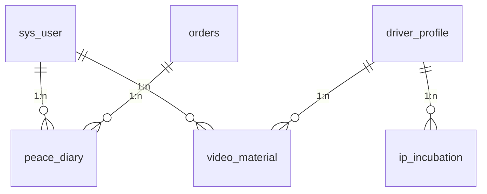
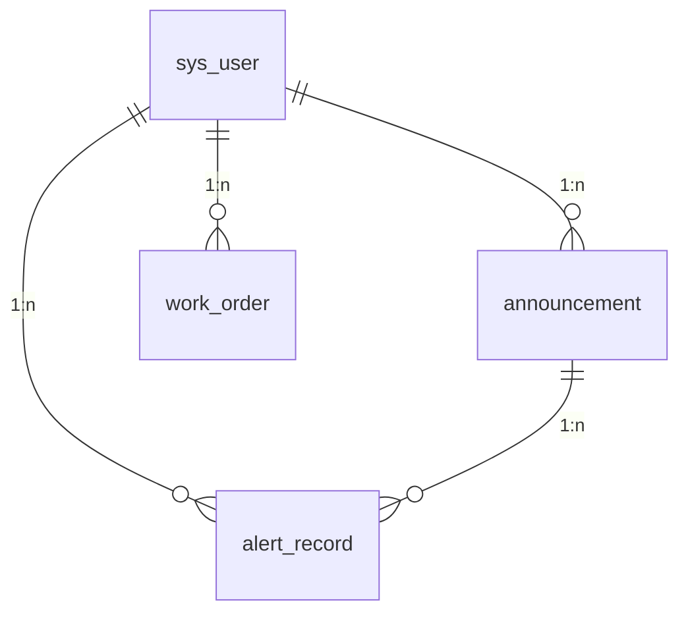

# 9-10. 内容社区与运营支撑模块

> **导航**：[支付财务与位置轨迹模块](05-支付财务与位置轨迹模块.md) | **内容社区与运营支撑模块** | [索引设计与初始化数据](07-索引设计与初始化数据.md)

---

## 9. 内容社区模块

### 9.1 模块 ER 图

### 9.2 表结构

#### 9.2.1 peace_diary — 安心日记表

| 字段名 | 类型 | 约束 | 说明 |
|--------|------|------|------|
| id | BIGINT | PK, AUTO_INCREMENT | 主键 |
| order_id | BIGINT | FK(orders.id) | 关联订单 |
| parent_id | BIGINT | NOT NULL, FK(sys_user.id) | 发布家长 |
| driver_id | BIGINT | FK(sys_user.id) | 接送员 |
| title | VARCHAR(100) | NOT NULL | 日记标题 |
| content | TEXT | NOT NULL | 日记正文 |
| photos | VARCHAR(2000) | | 照片 URL 列表（JSON 数组） |
| video_url | VARCHAR(500) | | 视频 URL |
| rating | TINYINT | | 评分（1-5 星） |
| tag_ids | VARCHAR(200) | | 标签 ID 列表（JSON 数组） |
| view_count | INT | NOT NULL, DEFAULT 0 | 浏览次数 |
| like_count | INT | NOT NULL, DEFAULT 0 | 点赞次数 |
| comment_count | INT | NOT NULL, DEFAULT 0 | 评论次数 |
| share_count | INT | NOT NULL, DEFAULT 0 | 分享次数 |
| is_top | TINYINT | NOT NULL, DEFAULT 0 | 是否置顶 |
| status | TINYINT | NOT NULL, DEFAULT 1 | 0-草稿 1-已发布 2-已隐藏 3-审核未通过 |
| published_at | DATETIME | | 发布时间 |
| created_at | DATETIME | NOT NULL, DEFAULT CURRENT_TIMESTAMP | 创建时间 |
| updated_at | DATETIME | NOT NULL, DEFAULT CURRENT_TIMESTAMP ON UPDATE | 更新时间 |

**索引**：`idx_peace_diary_parent_id` (parent_id), `idx_peace_diary_order_id` (order_id), `idx_peace_diary_status` (status), `idx_peace_diary_published_at` (published_at)

---

#### 9.2.2 video_material — 视频素材表

| 字段名 | 类型 | 约束 | 说明 |
|--------|------|------|------|
| id | BIGINT | PK, AUTO_INCREMENT | 主键 |
| driver_id | BIGINT | NOT NULL, FK(sys_user.id) | 视频上传者 |
| title | VARCHAR(200) | NOT NULL | 视频标题 |
| description | TEXT | | 视频描述 |
| cover_url | VARCHAR(500) | | 封面图 URL |
| video_url | VARCHAR(500) | NOT NULL | 视频文件 URL |
| duration | INT | | 视频时长（秒） |
| file_size | BIGINT | | 文件大小（字节） |
| width | INT | | 视频宽度（px） |
| height | INT | | 视频高度（px） |
| category | TINYINT | NOT NULL | 1-接送实录 2-培训视频 3-活动视频 4-风采展示 |
| tag_ids | VARCHAR(200) | | 标签列表（JSON 数组） |
| view_count | INT | NOT NULL, DEFAULT 0 | 播放次数 |
| like_count | INT | NOT NULL, DEFAULT 0 | 点赞次数 |
| status | TINYINT | NOT NULL, DEFAULT 1 | 1-待审核 2-已通过 3-未通过 4-已下架 |
| reviewed_at | DATETIME | | 审核时间 |
| reviewed_by | BIGINT | FK(sys_user.id) | 审核人 |
| published_at | DATETIME | | 发布时间 |
| created_at | DATETIME | NOT NULL, DEFAULT CURRENT_TIMESTAMP | 创建时间 |
| updated_at | DATETIME | NOT NULL, DEFAULT CURRENT_TIMESTAMP ON UPDATE | 更新时间 |

**索引**：`idx_video_material_driver_id` (driver_id), `idx_video_material_status` (status), `idx_video_material_category` (category), `idx_video_material_published_at` (published_at)

---

#### 9.2.3 livestream_record — 直播记录表

| 字段名 | 类型 | 约束 | 说明 |
|--------|------|------|------|
| id | BIGINT | PK, AUTO_INCREMENT | 主键 |
| driver_id | BIGINT | NOT NULL, FK(sys_user.id) | 主播接送员 |
| title | VARCHAR(200) | NOT NULL | 直播标题 |
| cover_url | VARCHAR(500) | | 直播封面 |
| stream_url | VARCHAR(500) | | 推流地址 |
| pull_url | VARCHAR(500) | | 拉流播放地址 |
| status | TINYINT | NOT NULL, DEFAULT 0 | 0-预告 1-直播中 2-已结束 3-录播回放 |
| scheduled_start_at | DATETIME | | 计划开始时间 |
| actual_start_at | DATETIME | | 实际开始时间 |
| ended_at | DATETIME | | 结束时间 |
| duration | INT | | 直播时长（秒） |
| peak_viewer_count | INT | NOT NULL, DEFAULT 0 | 峰值观看人数 |
| total_view_count | INT | NOT NULL, DEFAULT 0 | 累计观看次数 |
| like_count | INT | NOT NULL, DEFAULT 0 | 点赞数 |
| viewer_count | INT | NOT NULL, DEFAULT 0 | 观看人数 |
| created_at | DATETIME | NOT NULL, DEFAULT CURRENT_TIMESTAMP | 创建时间 |
| updated_at | DATETIME | NOT NULL, DEFAULT CURRENT_TIMESTAMP ON UPDATE | 更新时间 |

**索引**：`idx_livestream_driver_id` (driver_id), `idx_livestream_status` (status), `idx_livestream_scheduled_at` (scheduled_start_at)

---

#### 9.2.4 ip_incubation — IP 孵化表

| 字段名 | 类型 | 约束 | 说明 |
|--------|------|------|------|
| id | BIGINT | PK, AUTO_INCREMENT | 主键 |
| driver_id | BIGINT | NOT NULL, FK(sys_user.id) | 接送员 |
| ip_name | VARCHAR(100) | NOT NULL | IP 名称/昵称 |
| avatar_url | VARCHAR(500) | | IP 头像 |
| bio | VARCHAR(500) | | IP 简介 |
| ip_level | TINYINT | NOT NULL, DEFAULT 1 | IP 等级（1-5） |
| fans_count | INT | NOT NULL, DEFAULT 0 | 粉丝数 |
| content_count | INT | NOT NULL, DEFAULT 0 | 内容作品数 |
| total_views | BIGINT | NOT NULL, DEFAULT 0 | 累计播放量 |
| total_likes | INT | NOT NULL, DEFAULT 0 | 累计点赞 |
| exposure_value | DECIMAL(12,2) | NOT NULL, DEFAULT 0.00 | 曝光值 |
| commercial_value | DECIMAL(12,2) | NOT NULL, DEFAULT 0.00 | 商业价值估值（元） |
| status | TINYINT | NOT NULL, DEFAULT 1 | 1-孵化中 2-成熟期 3-已退出 |
| growth_plan | TEXT | | 成长计划（JSON） |
| mentor_id | BIGINT | FK(sys_user.id) | 运营导师 |
| created_at | DATETIME | NOT NULL, DEFAULT CURRENT_TIMESTAMP | 创建时间 |
| updated_at | DATETIME | NOT NULL, DEFAULT CURRENT_TIMESTAMP ON UPDATE | 更新时间 |

**索引**：`idx_ip_incubation_driver_id` (driver_id), `idx_ip_incubation_level` (ip_level), `idx_ip_incubation_status` (status)

---

#### 9.2.5 value_added_service — 增值服务表

| 字段名 | 类型 | 约束 | 说明 |
|--------|------|------|------|
| id | BIGINT | PK, AUTO_INCREMENT | 主键 |
| name | VARCHAR(100) | NOT NULL | 服务名称 |
| service_type | TINYINT | NOT NULL | 1-额外保障险 2-优先派单 3-专属客服 4-定制接送 5-实时监控增强 |
| description | TEXT | NOT NULL | 服务说明 |
| icon_url | VARCHAR(500) | | 服务图标 |
| price | DECIMAL(10,2) | NOT NULL | 单次价格（元） |
| monthly_price | DECIMAL(10,2) | | 月卡价格（元） |
| yearly_price | DECIMAL(10,2) | | 年卡价格（元） |
| applicable_scope | TINYINT | NOT NULL | 1-全平台 2-指定区域 3-指定学校 |
| scope_details | VARCHAR(500) | | 适用范围详情（JSON） |
| duration_days | INT | NOT NULL | 有效期（天） |
| sort_order | INT | NOT NULL, DEFAULT 0 | 排序 |
| is_active | TINYINT | NOT NULL, DEFAULT 1 | 0-下线 1-在售 |
| created_at | DATETIME | NOT NULL, DEFAULT CURRENT_TIMESTAMP | 创建时间 |
| updated_at | DATETIME | NOT NULL, DEFAULT CURRENT_TIMESTAMP ON UPDATE | 更新时间 |

**索引**：`idx_value_added_service_type` (service_type), `idx_value_added_service_active` (is_active)

---

## 10. 运营支撑模块

### 10.1 模块 ER 图

### 10.2 表结构

#### 10.2.1 announcement — 公告表

| 字段名 | 类型 | 约束 | 说明 |
|--------|------|------|------|
| id | BIGINT | PK, AUTO_INCREMENT | 主键 |
| title | VARCHAR(200) | NOT NULL | 公告标题 |
| content | TEXT | NOT NULL | 公告正文 |
| summary | VARCHAR(500) | | 摘要 |
| cover_url | VARCHAR(500) | | 封面图 |
| announcement_type | TINYINT | NOT NULL | 1-系统公告 2-活动通知 3-版本更新 4-安全预警 |
| target_audience | TINYINT | NOT NULL | 1-全部用户 2-家长 3-接送员 4-指定用户 |
| target_user_ids | TEXT | | 指定用户 ID 列表（JSON，目标为指定用户时） |
| priority | TINYINT | NOT NULL, DEFAULT 0 | 优先级 0-普通 1-重要 2-紧急 |
| is_top | TINYINT | NOT NULL, DEFAULT 0 | 是否置顶 |
| is_popup | TINYINT | NOT NULL, DEFAULT 0 | 是否弹窗展示 |
| start_time | DATETIME | | 展示开始时间 |
| end_time | DATETIME | | 展示结束时间 |
| view_count | INT | NOT NULL, DEFAULT 0 | 阅读次数 |
| status | TINYINT | NOT NULL, DEFAULT 1 | 0-草稿 1-已发布 2-已下架 |
| published_at | DATETIME | | 发布时间 |
| created_by | BIGINT | NOT NULL, FK(sys_user.id) | 创建人 |
| created_at | DATETIME | NOT NULL, DEFAULT CURRENT_TIMESTAMP | 创建时间 |
| updated_at | DATETIME | NOT NULL, DEFAULT CURRENT_TIMESTAMP ON UPDATE | 更新时间 |

**索引**：`idx_announcement_status` (status), `idx_announcement_type` (announcement_type), `idx_announcement_published_at` (published_at), `idx_announcement_target_audience` (target_audience)

---

#### 10.2.2 work_order — 工单表

| 字段名 | 类型 | 约束 | 说明 |
|--------|------|------|------|
| id | BIGINT | PK, AUTO_INCREMENT | 主键 |
| order_no | VARCHAR(32) | NOT NULL, UNIQUE | 工单编号 |
| title | VARCHAR(200) | NOT NULL | 工单标题 |
| category | TINYINT | NOT NULL | 1-订单问题 2-支付问题 3-接送问题 4-评价投诉 5-功能建议 6-账号问题 7-其他 |
| priority | TINYINT | NOT NULL, DEFAULT 2 | 1-紧急 2-高 3-中 4-低 |
| description | TEXT | NOT NULL | 工单描述 |
| attach_urls | VARCHAR(2000) | | 附件 URL 列表（JSON 数组） |
| order_id | BIGINT | FK(orders.id) | 关联订单（若有） |
| creator_id | BIGINT | NOT NULL, FK(sys_user.id) | 创建人 |
| creator_type | TINYINT | NOT NULL | 1-家长 2-接送员 3-客服 4-系统 |
| handler_id | BIGINT | FK(sys_user.id) | 处理人（客服） |
| handler_group | VARCHAR(50) | | 处理组 |
| status | TINYINT | NOT NULL, DEFAULT 0 | 0-待分配 1-处理中 2-待确认 3-已完成 4-已评价 5-已关闭 |
| satisfaction_rating | TINYINT | | 满意度评分（1-5） |
| response_count | INT | NOT NULL, DEFAULT 0 | 回复次数 |
| first_response_at | DATETIME | | 首次响应时间 |
| resolved_at | DATETIME | | 解决时间 |
| closed_at | DATETIME | | 关闭时间 |
| created_at | DATETIME | NOT NULL, DEFAULT CURRENT_TIMESTAMP | 创建时间 |
| updated_at | DATETIME | NOT NULL, DEFAULT CURRENT_TIMESTAMP ON UPDATE | 更新时间 |

**索引**：`idx_work_order_no` (order_no), `idx_work_order_creator_id` (creator_id), `idx_work_order_handler_id` (handler_id), `idx_work_order_status` (status), `idx_work_order_category` (category)

---

#### 10.2.3 system_config — 系统配置表

| 字段名 | 类型 | 约束 | 说明 |
|--------|------|------|------|
| id | BIGINT | PK, AUTO_INCREMENT | 主键 |
| config_key | VARCHAR(100) | NOT NULL, UNIQUE | 配置键（如 app.version.force_update） |
| config_value | TEXT | NOT NULL | 配置值（JSON 格式） |
| config_type | TINYINT | NOT NULL | 1-字符串 2-数字 3-布尔 4-JSON 对象 5-JSON 数组 |
| config_group | VARCHAR(50) | NOT NULL | 配置分组（如 payment, order, push） |
| description | VARCHAR(500) | | 配置说明 |
| is_env | TINYINT | NOT NULL, DEFAULT 0 | 是否环境变量（0-否 1-是） |
| is_secret | TINYINT | NOT NULL, DEFAULT 0 | 是否敏感配置（脱敏展示） |
| is_active | TINYINT | NOT NULL, DEFAULT 1 | 0-停用 1-启用 |
| sort_order | INT | NOT NULL, DEFAULT 0 | 排序 |
| valid_from | DATETIME | | 生效时间 |
| valid_until | DATETIME | | 失效时间 |
| created_by | BIGINT | FK(sys_user.id) | 创建人 |
| created_at | DATETIME | NOT NULL, DEFAULT CURRENT_TIMESTAMP | 创建时间 |
| updated_at | DATETIME | NOT NULL, DEFAULT CURRENT_TIMESTAMP ON UPDATE | 更新时间 |

**索引**：`idx_system_config_key` (config_key), `idx_system_config_group` (config_group), `idx_system_config_active` (is_active)

---

#### 10.2.4 alert_record — 预警记录表

| 字段名 | 类型 | 约束 | 说明 |
|--------|------|------|------|
| id | BIGINT | PK, AUTO_INCREMENT | 主键 |
| alert_type | VARCHAR(50) | NOT NULL | 预警类型（如 order.delay, driver.location.drift） |
| alert_level | TINYINT | NOT NULL | 1-信息 2-警告 3-严重 4-紧急 |
| title | VARCHAR(200) | NOT NULL | 预警标题 |
| content | TEXT | NOT NULL | 预警内容 |
| source_type | TINYINT | NOT NULL | 1-订单监控 2-司机行为 3-支付风控 4-系统监控 5-用户投诉 |
| source_id | BIGINT | | 来源ID（如 order_id, driver_id） |
| rule_id | VARCHAR(50) | | 触发规则 ID |
| rule_name | VARCHAR(100) | | 触发规则名称 |
| trigger_value | VARCHAR(500) | | 触发时原始值 |
| threshold_value | VARCHAR(200) | | 阈值 |
| operator_id | BIGINT | FK(sys_user.id) | 被预警操作人 |
| operator_type | TINYINT | | 1-家长 2-接送员 |
| is_auto_handled | TINYINT | NOT NULL, DEFAULT 0 | 是否系统自动处理 0-否 1-是 |
| handle_result | VARCHAR(500) | | 处理结果 |
| handler_id | BIGINT | FK(sys_user.id) | 处理人 |
| handled_at | DATETIME | | 处理时间 |
| status | TINYINT | NOT NULL, DEFAULT 0 | 0-待处理 1-处理中 2-已解决 3-已忽略 4-已升级 |
| resolved_at | DATETIME | | 解决时间 |
| created_at | DATETIME | NOT NULL, DEFAULT CURRENT_TIMESTAMP | 创建时间 |
| updated_at | DATETIME | NOT NULL, DEFAULT CURRENT_TIMESTAMP ON UPDATE | 更新时间 |

**索引**：`idx_alert_record_type` (alert_type), `idx_alert_record_level` (alert_level), `idx_alert_record_status` (status), `idx_alert_record_operator_id` (operator_id), `idx_alert_record_created_at` (created_at)

---

#### 10.2.5 leaderboard — 排行榜表

| 字段名 | 类型 | 约束 | 说明 |
|--------|------|------|------|
| id | BIGINT | PK, AUTO_INCREMENT | 主键 |
| board_type | TINYINT | NOT NULL | 1-接送员评分榜 2-接送员完单榜 3-家长好评榜 4-活跃家长榜 |
| ranking_period | VARCHAR(20) | NOT NULL | 周期（如 2025-01 月榜，2025-W03 周榜，2025-01-01 日榜） |
| user_id | BIGINT | NOT NULL, FK(sys_user.id) | 用户 |
| user_type | TINYINT | NOT NULL | 1-家长 2-接送员 |
| rank_position | INT | NOT NULL | 排名（1-N） |
| score | DECIMAL(12,2) | NOT NULL | 得分（如评分、订单数等） |
| badge_name | VARCHAR(50) | | 称号（如"月度之星"） |
| badge_icon | VARCHAR(500) | | 称号图标 |
| data_snapshot | TEXT | | 数据快照（JSON） |
| created_at | DATETIME | NOT NULL, DEFAULT CURRENT_TIMESTAMP | 创建时间 |

**索引**：`idx_leaderboard_type_period` (board_type, ranking_period), `idx_leaderboard_user` (user_id, user_type), `idx_leaderboard_rank` (rank_position)

---

> **上一节**：[支付财务与位置轨迹模块](05-支付财务与位置轨迹模块.md) | **下一节**：[索引设计与初始化数据](07-索引设计与初始化数据.md)
