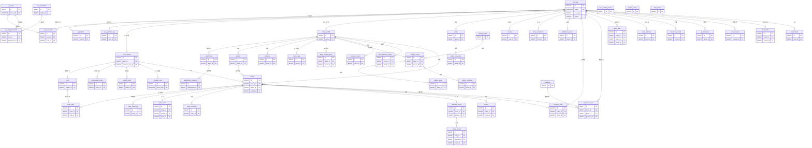

# 安心接送平台 — 整体 ER 图

> 本图展示全部 42 张表及其跨模块关联关系。由于表数量较多，仅列出主键和外键字段，完整字段定义见各子模块 ER 图。

```mermaid
erDiagram
    %% ========== Part 1: 用户与认证模块 ==========
    sys_user {
        BIGINT id PK
        VARCHAR phone UK
        TINYINT user_type
        TINYINT status
    }
    sys_admin {
        BIGINT id PK
        BIGINT user_id FK
    }
    sys_role {
        BIGINT id PK
        VARCHAR role_code UK
    }
    sys_permission {
        BIGINT id PK
        BIGINT parent_id
    }
    sys_user_role {
        BIGINT id PK
        BIGINT user_id FK
        BIGINT role_id FK
    }
    sys_role_permission {
        BIGINT id PK
        BIGINT role_id FK
        BIGINT permission_id FK
    }
    sys_operation_log {
        BIGINT id PK
        BIGINT user_id FK
    }

    %% ========== Part 2: 家长端模块 ==========
    parent_profile {
        BIGINT id PK
        BIGINT user_id FK
        BIGINT member_level_id FK
    }
    child {
        BIGINT id PK
        BIGINT parent_id FK
    }
    emergency_contact {
        BIGINT id PK
        BIGINT parent_id FK
    }
    address_book {
        BIGINT id PK
        BIGINT parent_id FK
    }
    wallet {
        BIGINT id PK
        BIGINT user_id FK
    }
    wallet_transaction {
        BIGINT id PK
        BIGINT wallet_id FK
    }
    member_level {
        BIGINT id PK
        VARCHAR level_code UK
    }
    coupon {
        BIGINT id PK
        BIGINT user_id FK
    }

    %% ========== Part 3: 接送员端模块 ==========
    driver_profile {
        BIGINT id PK
        BIGINT user_id FK
    }
    qualification {
        BIGINT id PK
        BIGINT driver_id FK
    }
    qualification_document {
        BIGINT id PK
        BIGINT qualification_id FK
    }
    vehicle {
        BIGINT id PK
        BIGINT driver_id FK
    }
    schedule {
        BIGINT id PK
        BIGINT driver_id FK
    }
    fixed_route {
        BIGINT id PK
        BIGINT driver_id FK
    }
    driver_review_parent {
        BIGINT id PK
        BIGINT driver_id FK
        BIGINT parent_id FK
    }
    training_course {
        BIGINT id PK
    }
    training_enroll {
        BIGINT id PK
        BIGINT driver_id FK
        BIGINT course_id FK
    }
    training_exam {
        BIGINT id PK
        BIGINT enroll_id FK
    }
    training_certificate {
        BIGINT id PK
        BIGINT enroll_id FK
    }
    insurance_policy {
        BIGINT id PK
        BIGINT driver_id FK
    }
    driver_blacklist_parent {
        BIGINT id PK
        BIGINT driver_id FK
        BIGINT parent_id FK
    }

    %% ========== Part 4: 订单核心模块 ==========
    orders {
        BIGINT id PK
        BIGINT parent_id FK
        BIGINT driver_id FK
        BIGINT vehicle_id FK
    }
    order_child {
        BIGINT id PK
        BIGINT order_id FK
        BIGINT child_id FK
    }
    order_status_log {
        BIGINT id PK
        BIGINT order_id FK
    }
    order_review {
        BIGINT id PK
        BIGINT order_id FK
        BIGINT parent_id FK
        BIGINT driver_id FK
    }
    order_exception {
        BIGINT id PK
        BIGINT order_id FK
    }

    %% ========== Part 5: 支付财务模块 ==========
    payment_record {
        BIGINT id PK
        BIGINT order_id FK
        BIGINT parent_id FK
    }
    refund_record {
        BIGINT id PK
        BIGINT order_id FK
        BIGINT payment_id FK
        BIGINT parent_id FK
    }
    invoice {
        BIGINT id PK
        BIGINT order_id FK
        BIGINT parent_id FK
    }
    driver_settlement {
        BIGINT id PK
        BIGINT driver_id FK
    }
    withdrawal_request {
        BIGINT id PK
        BIGINT driver_id FK
    }

    %% ========== Part 6: 位置轨迹模块 ==========
    trajectory_point {
        BIGINT id PK
        BIGINT order_id FK
        BIGINT driver_id FK
    }
    geofence {
        BIGINT id PK
    }
    geofence_event {
        BIGINT id PK
        BIGINT order_id FK
        BIGINT driver_id FK
        BIGINT geofence_id FK
    }

    %% ========== Part 7: 内容社区模块 ==========
    peace_diary {
        BIGINT id PK
        BIGINT order_id FK
        BIGINT parent_id FK
        BIGINT driver_id FK
    }
    video_material {
        BIGINT id PK
        BIGINT driver_id FK
    }
    livestream_record {
        BIGINT id PK
        BIGINT driver_id FK
    }
    ip_incubation {
        BIGINT id PK
        BIGINT driver_id FK
    }
    value_added_service {
        BIGINT id PK
    }

    %% ========== Part 8: 运营支撑模块 ==========
    announcement {
        BIGINT id PK
        BIGINT created_by FK
    }
    work_order {
        BIGINT id PK
        BIGINT order_id FK
        BIGINT creator_id FK
    }
    system_config {
        BIGINT id PK
    }
    alert_record {
        BIGINT id PK
    }
    leaderboard {
        BIGINT id PK
        BIGINT user_id FK
    }

    %% ========== 跨模块关联关系 ==========
    %% 用户与认证内部
    sys_user ||--o| sys_admin : "管理员扩展"
    sys_user ||--o{ sys_user_role : "分配角色"
    sys_role ||--o{ sys_user_role : "关联用户"
    sys_role ||--o{ sys_role_permission : "分配权限"
    sys_permission ||--o{ sys_role_permission : "关联角色"
    sys_user ||--o{ sys_operation_log : "操作日志"

    %% 用户 → 家长/接送员
    sys_user ||--o| parent_profile : "家长扩展"
    sys_user ||--o| driver_profile : "接送员扩展"
    sys_user ||--o| wallet : "钱包"
    sys_user ||--o{ coupon : "优惠券"

    %% 家长模块内部
    parent_profile ||--o{ child : "拥有孩子"
    parent_profile ||--o{ emergency_contact : "紧急联系人"
    parent_profile ||--o{ address_book : "地址簿"
    parent_profile }o--o| member_level : "会员等级"
    wallet ||--o{ wallet_transaction : "流水"

    %% 接送员模块内部
    driver_profile ||--o{ qualification : "资质认证"
    qualification ||--o{ qualification_document : "资质材料"
    driver_profile ||--o{ vehicle : "车辆"
    driver_profile ||--o{ schedule : "排班"
    driver_profile ||--o{ fixed_route : "固定线路"
    driver_profile ||--o{ driver_review_parent : "评价家长"
    driver_profile ||--o{ training_enroll : "培训报名"
    training_course ||--o{ training_enroll : "课程"
    training_enroll ||--o| training_exam : "考试"
    training_enroll ||--o| training_certificate : "证书"
    driver_profile ||--o{ insurance_policy : "保险"
    driver_profile ||--o{ driver_blacklist_parent : "黑名单"

    %% 订单核心
    parent_profile ||--o{ orders : "下单"
    driver_profile ||--o{ orders : "接单"
    vehicle ||--o{ orders : "服务车辆"
    orders ||--o{ order_child : "包含孩子"
    orders ||--o{ order_status_log : "状态流转"
    orders ||--o| order_review : "评价"
    orders ||--o{ order_exception : "异常"
    child ||--o{ order_child : "参与订单"

    %% 支付财务
    orders ||--o| payment_record : "支付"
    payment_record ||--o{ refund_record : "退款"
    orders ||--o{ invoice : "发票"
    sys_user ||--o{ driver_settlement : "结算"
    sys_user ||--o{ withdrawal_request : "提现"

    %% 位置轨迹
    orders ||--o{ trajectory_point : "轨迹"
    sys_user ||--o{ trajectory_point : "上传轨迹"
    geofence ||--o{ geofence_event : "触发事件"
    orders ||--o{ geofence_event : "围栏事件"
    sys_user ||--o{ geofence_event : "触发围栏"

    %% 内容社区
    sys_user ||--o{ peace_diary : "发布日记"
    sys_user ||--o{ video_material : "上传视频"
    sys_user ||--o{ livestream_record : "开播"
    sys_user ||--o{ ip_incubation : "IP孵化"

    %% 运营支撑
    sys_user ||--o{ announcement : "创建公告"
    sys_user ||--o{ work_order : "创建工单"
    sys_user ||--o{ leaderboard : "上榜"
```
