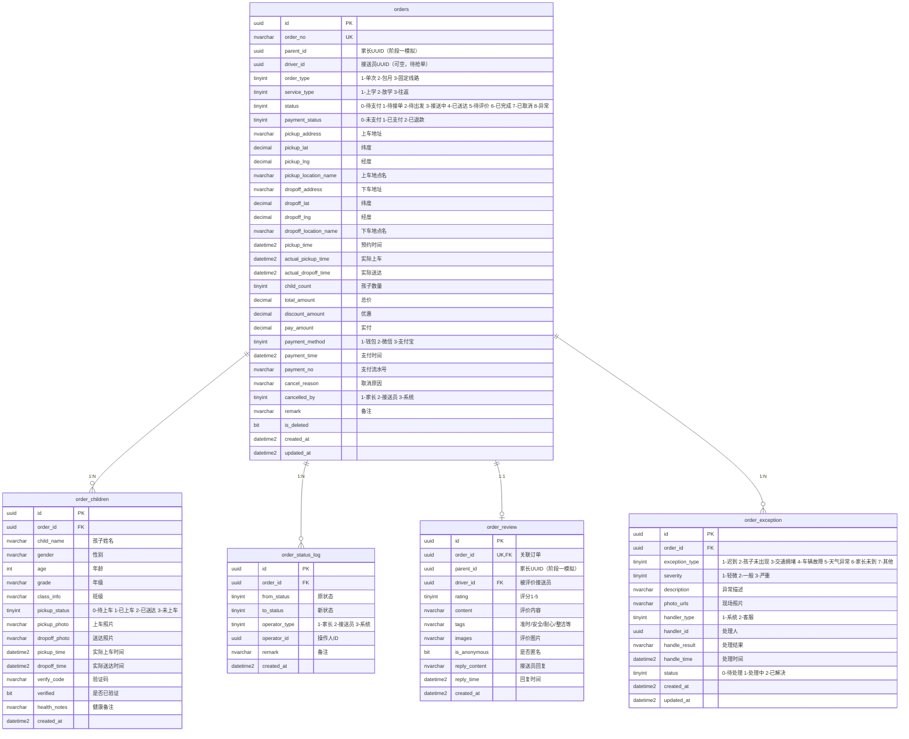

# 04-订单核心模块 ER 图

```mermaid
erDiagram
    orders ||--o{ order_children : "1:N"
    orders ||--o{ order_status_log : "1:N"
    orders ||--o| order_review : "1:1"
    orders ||--o{ order_exception : "1:N"

    orders {
        uuid id PK
        nvarchar order_no UK
        uuid parent_id "家长UUID（阶段一模拟）"
        uuid driver_id "接送员UUID（可空，待抢单）"
        tinyint order_type "1-单次 2-包月 3-固定线路"
        tinyint service_type "1-上学 2-放学 3-往返"
        tinyint status "0-待支付 1-待接单 2-待出发 3-接送中 4-已送达 5-待评价 6-已完成 7-已取消 8-异常"
        tinyint payment_status "0-未支付 1-已支付 2-已退款"
        nvarchar pickup_address "上车地址"
        decimal pickup_lat "纬度"
        decimal pickup_lng "经度"
        nvarchar pickup_location_name "上车地点名"
        nvarchar dropoff_address "下车地址"
        decimal dropoff_lat "纬度"
        decimal dropoff_lng "经度"
        nvarchar dropoff_location_name "下车地点名"
        datetime2 pickup_time "预约时间"
        datetime2 actual_pickup_time "实际上车"
        datetime2 actual_dropoff_time "实际送达"
        tinyint child_count "孩子数量"
        decimal total_amount "总价"
        decimal discount_amount "优惠"
        decimal pay_amount "实付"
        tinyint payment_method "1-钱包 2-微信 3-支付宝"
        datetime2 payment_time "支付时间"
        nvarchar payment_no "支付流水号"
        nvarchar cancel_reason "取消原因"
        tinyint cancelled_by "1-家长 2-接送员 3-系统"
        nvarchar remark "备注"
        bit is_deleted
        datetime2 created_at
        datetime2 updated_at
    }

    order_children {
        uuid id PK
        uuid order_id FK
        nvarchar child_name "孩子姓名"
        nvarchar gender "性别"
        int age "年龄"
        nvarchar grade "年级"
        nvarchar class_info "班级"
        tinyint pickup_status "0-待上车 1-已上车 2-已送达 3-未上车"
        nvarchar pickup_photo "上车照片"
        nvarchar dropoff_photo "送达照片"
        datetime2 pickup_time "实际上车时间"
        datetime2 dropoff_time "实际送达时间"
        nvarchar verify_code "验证码"
        bit verified "是否已验证"
        nvarchar health_notes "健康备注"
        datetime2 created_at
    }

    order_status_log {
        uuid id PK
        uuid order_id FK
        tinyint from_status "原状态"
        tinyint to_status "新状态"
        tinyint operator_type "1-家长 2-接送员 3-系统"
        uuid operator_id "操作人ID"
        nvarchar remark "备注"
        datetime2 created_at
    }

    order_review {
        uuid id PK
        uuid order_id UK, FK "关联订单"
        uuid parent_id "家长UUID（阶段一模拟）"
        uuid driver_id FK "被评价接送员"
        tinyint rating "评分1-5"
        nvarchar content "评价内容"
        nvarchar tags "准时/安全/耐心/整洁等"
        nvarchar images "评价图片"
        bit is_anonymous "是否匿名"
        nvarchar reply_content "接送员回复"
        datetime2 reply_time "回复时间"
        datetime2 created_at
    }

    order_exception {
        uuid id PK
        uuid order_id FK
        tinyint exception_type "1-迟到 2-孩子未出现 3-交通拥堵 4-车辆故障 5-天气异常 6-家长未到 7-其他"
        tinyint severity "1-轻微 2-一般 3-严重"
        nvarchar description "异常描述"
        nvarchar photo_urls "现场照片"
        tinyint handler_type "1-系统 2-客服"
        uuid handler_id "处理人"
        nvarchar handle_result "处理结果"
        datetime2 handle_time "处理时间"
        tinyint status "0-待处理 1-处理中 2-已解决"
        datetime2 created_at
        datetime2 updated_at
    }
```
