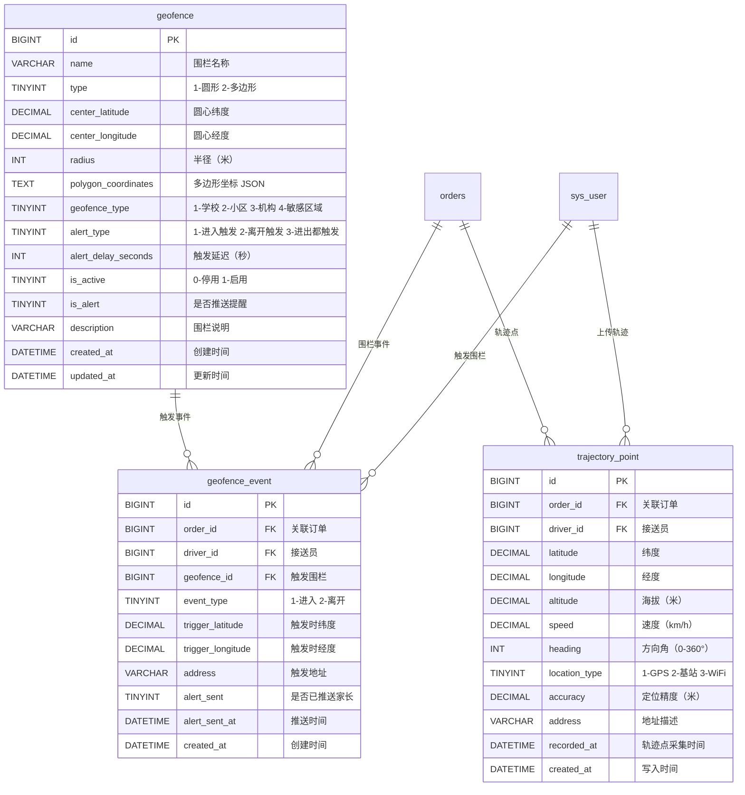

# 位置轨迹模块 ER 图

```mermaid
erDiagram
    trajectory_point {
        BIGINT id PK
        BIGINT order_id FK "关联订单"
        BIGINT driver_id FK "接送员"
        DECIMAL latitude "纬度"
        DECIMAL longitude "经度"
        DECIMAL altitude "海拔（米）"
        DECIMAL speed "速度（km/h）"
        INT heading "方向角（0-360°）"
        TINYINT location_type "1-GPS 2-基站 3-WiFi"
        DECIMAL accuracy "定位精度（米）"
        VARCHAR address "地址描述"
        DATETIME recorded_at "轨迹点采集时间"
        DATETIME created_at "写入时间"
    }

    geofence {
        BIGINT id PK
        VARCHAR name "围栏名称"
        TINYINT type "1-圆形 2-多边形"
        DECIMAL center_latitude "圆心纬度"
        DECIMAL center_longitude "圆心经度"
        INT radius "半径（米）"
        TEXT polygon_coordinates "多边形坐标 JSON"
        TINYINT geofence_type "1-学校 2-小区 3-机构 4-敏感区域"
        TINYINT alert_type "1-进入触发 2-离开触发 3-进出都触发"
        INT alert_delay_seconds "触发延迟（秒）"
        TINYINT is_active "0-停用 1-启用"
        TINYINT is_alert "是否推送提醒"
        VARCHAR description "围栏说明"
        DATETIME created_at "创建时间"
        DATETIME updated_at "更新时间"
    }

    geofence_event {
        BIGINT id PK
        BIGINT order_id FK "关联订单"
        BIGINT driver_id FK "接送员"
        BIGINT geofence_id FK "触发围栏"
        TINYINT event_type "1-进入 2-离开"
        DECIMAL trigger_latitude "触发时纬度"
        DECIMAL trigger_longitude "触发时经度"
        VARCHAR address "触发地址"
        TINYINT alert_sent "是否已推送家长"
        DATETIME alert_sent_at "推送时间"
        DATETIME created_at "创建时间"
    }

    geofence ||--o{ geofence_event : "触发事件"
    orders ||--o{ trajectory_point : "轨迹点"
    orders ||--o{ geofence_event : "围栏事件"
    sys_user ||--o{ trajectory_point : "上传轨迹"
    sys_user ||--o{ geofence_event : "触发围栏"
```
