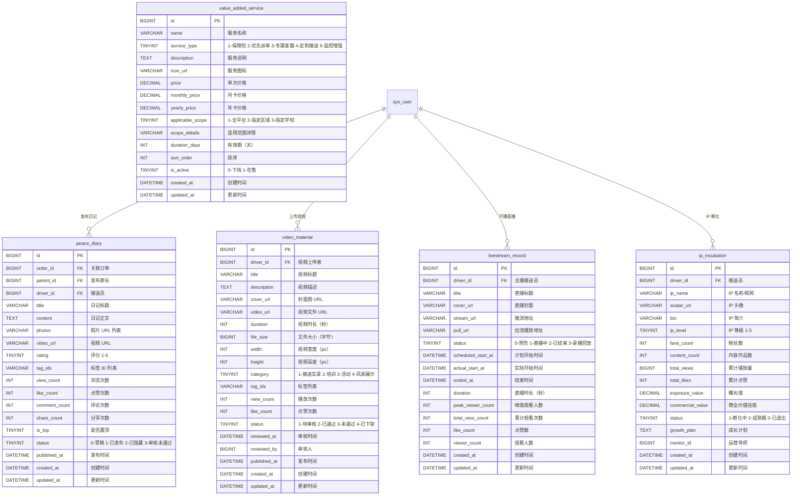

# 内容社区模块 ER 图

```mermaid
erDiagram
    peace_diary {
        BIGINT id PK
        BIGINT order_id FK "关联订单"
        BIGINT parent_id FK "发布家长"
        BIGINT driver_id FK "接送员"
        VARCHAR title "日记标题"
        TEXT content "日记正文"
        VARCHAR photos "照片 URL 列表"
        VARCHAR video_url "视频 URL"
        TINYINT rating "评分 1-5"
        VARCHAR tag_ids "标签 ID 列表"
        INT view_count "浏览次数"
        INT like_count "点赞次数"
        INT comment_count "评论次数"
        INT share_count "分享次数"
        TINYINT is_top "是否置顶"
        TINYINT status "0-草稿 1-已发布 2-已隐藏 3-审核未通过"
        DATETIME published_at "发布时间"
        DATETIME created_at "创建时间"
        DATETIME updated_at "更新时间"
    }

    video_material {
        BIGINT id PK
        BIGINT driver_id FK "视频上传者"
        VARCHAR title "视频标题"
        TEXT description "视频描述"
        VARCHAR cover_url "封面图 URL"
        VARCHAR video_url "视频文件 URL"
        INT duration "视频时长（秒）"
        BIGINT file_size "文件大小（字节）"
        INT width "视频宽度（px）"
        INT height "视频高度（px）"
        TINYINT category "1-接送实录 2-培训 3-活动 4-风采展示"
        VARCHAR tag_ids "标签列表"
        INT view_count "播放次数"
        INT like_count "点赞次数"
        TINYINT status "1-待审核 2-已通过 3-未通过 4-已下架"
        DATETIME reviewed_at "审核时间"
        BIGINT reviewed_by "审核人"
        DATETIME published_at "发布时间"
        DATETIME created_at "创建时间"
        DATETIME updated_at "更新时间"
    }

    livestream_record {
        BIGINT id PK
        BIGINT driver_id FK "主播接送员"
        VARCHAR title "直播标题"
        VARCHAR cover_url "直播封面"
        VARCHAR stream_url "推流地址"
        VARCHAR pull_url "拉流播放地址"
        TINYINT status "0-预告 1-直播中 2-已结束 3-录播回放"
        DATETIME scheduled_start_at "计划开始时间"
        DATETIME actual_start_at "实际开始时间"
        DATETIME ended_at "结束时间"
        INT duration "直播时长（秒）"
        INT peak_viewer_count "峰值观看人数"
        INT total_view_count "累计观看次数"
        INT like_count "点赞数"
        INT viewer_count "观看人数"
        DATETIME created_at "创建时间"
        DATETIME updated_at "更新时间"
    }

    ip_incubation {
        BIGINT id PK
        BIGINT driver_id FK "接送员"
        VARCHAR ip_name "IP 名称/昵称"
        VARCHAR avatar_url "IP 头像"
        VARCHAR bio "IP 简介"
        TINYINT ip_level "IP 等级 1-5"
        INT fans_count "粉丝数"
        INT content_count "内容作品数"
        BIGINT total_views "累计播放量"
        INT total_likes "累计点赞"
        DECIMAL exposure_value "曝光值"
        DECIMAL commercial_value "商业价值估值"
        TINYINT status "1-孵化中 2-成熟期 3-已退出"
        TEXT growth_plan "成长计划"
        BIGINT mentor_id "运营导师"
        DATETIME created_at "创建时间"
        DATETIME updated_at "更新时间"
    }

    value_added_service {
        BIGINT id PK
        VARCHAR name "服务名称"
        TINYINT service_type "1-保障险 2-优先派单 3-专属客服 4-定制接送 5-监控增强"
        TEXT description "服务说明"
        VARCHAR icon_url "服务图标"
        DECIMAL price "单次价格"
        DECIMAL monthly_price "月卡价格"
        DECIMAL yearly_price "年卡价格"
        TINYINT applicable_scope "1-全平台 2-指定区域 3-指定学校"
        VARCHAR scope_details "适用范围详情"
        INT duration_days "有效期（天）"
        INT sort_order "排序"
        TINYINT is_active "0-下线 1-在售"
        DATETIME created_at "创建时间"
        DATETIME updated_at "更新时间"
    }

    sys_user ||--o{ peace_diary : "发布日记"
    sys_user ||--o{ video_material : "上传视频"
    sys_user ||--o{ livestream_record : "开播直播"
    sys_user ||--o{ ip_incubation : "IP 孵化"
```
