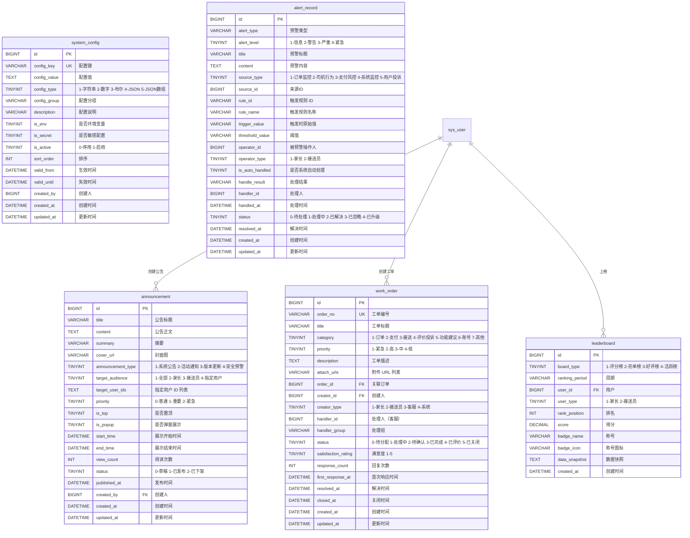

# 运营支撑模块 ER 图

```mermaid
erDiagram
    announcement {
        BIGINT id PK
        VARCHAR title "公告标题"
        TEXT content "公告正文"
        VARCHAR summary "摘要"
        VARCHAR cover_url "封面图"
        TINYINT announcement_type "1-系统公告 2-活动通知 3-版本更新 4-安全预警"
        TINYINT target_audience "1-全部 2-家长 3-接送员 4-指定用户"
        TEXT target_user_ids "指定用户 ID 列表"
        TINYINT priority "0-普通 1-重要 2-紧急"
        TINYINT is_top "是否置顶"
        TINYINT is_popup "是否弹窗展示"
        DATETIME start_time "展示开始时间"
        DATETIME end_time "展示结束时间"
        INT view_count "阅读次数"
        TINYINT status "0-草稿 1-已发布 2-已下架"
        DATETIME published_at "发布时间"
        BIGINT created_by FK "创建人"
        DATETIME created_at "创建时间"
        DATETIME updated_at "更新时间"
    }

    work_order {
        BIGINT id PK
        VARCHAR order_no UK "工单编号"
        VARCHAR title "工单标题"
        TINYINT category "1-订单 2-支付 3-接送 4-评价投诉 5-功能建议 6-账号 7-其他"
        TINYINT priority "1-紧急 2-高 3-中 4-低"
        TEXT description "工单描述"
        VARCHAR attach_urls "附件 URL 列表"
        BIGINT order_id FK "关联订单"
        BIGINT creator_id FK "创建人"
        TINYINT creator_type "1-家长 2-接送员 3-客服 4-系统"
        BIGINT handler_id "处理人（客服）"
        VARCHAR handler_group "处理组"
        TINYINT status "0-待分配 1-处理中 2-待确认 3-已完成 4-已评价 5-已关闭"
        TINYINT satisfaction_rating "满意度 1-5"
        INT response_count "回复次数"
        DATETIME first_response_at "首次响应时间"
        DATETIME resolved_at "解决时间"
        DATETIME closed_at "关闭时间"
        DATETIME created_at "创建时间"
        DATETIME updated_at "更新时间"
    }

    system_config {
        BIGINT id PK
        VARCHAR config_key UK "配置键"
        TEXT config_value "配置值"
        TINYINT config_type "1-字符串 2-数字 3-布尔 4-JSON 5-JSON数组"
        VARCHAR config_group "配置分组"
        VARCHAR description "配置说明"
        TINYINT is_env "是否环境变量"
        TINYINT is_secret "是否敏感配置"
        TINYINT is_active "0-停用 1-启用"
        INT sort_order "排序"
        DATETIME valid_from "生效时间"
        DATETIME valid_until "失效时间"
        BIGINT created_by "创建人"
        DATETIME created_at "创建时间"
        DATETIME updated_at "更新时间"
    }

    alert_record {
        BIGINT id PK
        VARCHAR alert_type "预警类型"
        TINYINT alert_level "1-信息 2-警告 3-严重 4-紧急"
        VARCHAR title "预警标题"
        TEXT content "预警内容"
        TINYINT source_type "1-订单监控 2-司机行为 3-支付风控 4-系统监控 5-用户投诉"
        BIGINT source_id "来源ID"
        VARCHAR rule_id "触发规则 ID"
        VARCHAR rule_name "触发规则名称"
        VARCHAR trigger_value "触发时原始值"
        VARCHAR threshold_value "阈值"
        BIGINT operator_id "被预警操作人"
        TINYINT operator_type "1-家长 2-接送员"
        TINYINT is_auto_handled "是否系统自动处理"
        VARCHAR handle_result "处理结果"
        BIGINT handler_id "处理人"
        DATETIME handled_at "处理时间"
        TINYINT status "0-待处理 1-处理中 2-已解决 3-已忽略 4-已升级"
        DATETIME resolved_at "解决时间"
        DATETIME created_at "创建时间"
        DATETIME updated_at "更新时间"
    }

    leaderboard {
        BIGINT id PK
        TINYINT board_type "1-评分榜 2-完单榜 3-好评榜 4-活跃榜"
        VARCHAR ranking_period "周期"
        BIGINT user_id FK "用户"
        TINYINT user_type "1-家长 2-接送员"
        INT rank_position "排名"
        DECIMAL score "得分"
        VARCHAR badge_name "称号"
        VARCHAR badge_icon "称号图标"
        TEXT data_snapshot "数据快照"
        DATETIME created_at "创建时间"
    }

    sys_user ||--o{ announcement : "创建公告"
    sys_user ||--o{ work_order : "创建工单"
    sys_user ||--o{ leaderboard : "上榜"
```
