# 安心接送平台 — 数据库设计文档（统一版 v2.0.0）

---

> **项目名称**：安心接送 — 儿童安全接送服务平台
> **文档类型**：数据库设计文档
> **数据库**：SQL Server 2019+（T-SQL）
> **编制日期**：2026 年 4 月
> **版本**：v2.0.0（统一版）
> **状态**：正式版

---

## 文档导航

本数据库设计文档已拆分为以下子文档，请按需查阅：

| 子文档 | 内容 | 说明 |
|--------|------|------|
| [00-概览与引言](00-概览与引言.md) | 版本历史、数据库设计概述、ER 总图 | 设计原则/技术选型/命名规范 |
| [01-用户与认证模块](01-用户与认证模块.md) | drivers / parents / admins / sms_codes / refresh_tokens | **三户独立模型** |
| [02-家长端模块](02-家长端模块.md) | 家长/孩子/钱包等（阶段一为模拟数据） | 保留，供后续扩展参考 |
| [03-接送员端模块](03-接送员端模块.md) | qualifications / qualification_documents / schedules / training | 不含 vehicles |
| [04-订单核心模块](04-订单核心模块.md) | orders（含 payment_status）/ order_children / order_status_log / order_review / order_exception | |
| [05-支付财务与位置轨迹模块](05-支付财务与位置轨迹模块.md) | 支付/退款/轨迹等（暂不实现） | 保留，供后续扩展参考 |
| [06-内容社区与运营支撑模块](06-内容社区与运营支撑模块.md) | 日记/视频/工单等（暂不实现） | 保留，供后续扩展参考 |
| [07-索引设计与初始化数据](07-索引设计与初始化数据.md) | 索引规范/T-SQL 语法/初始数据 | 含 admins 种子数据 |

### ER 图

所有 ER 图（Mermaid 格式）集中存放在 [`er-diagrams/`](er-diagrams/README.md) 目录：

| ER 图 | 说明 |
|--------|------|
| [整体 ER 图](er-diagrams/00-整体ER图.md) | 全平台 19 张表跨模块关联（统一版） |
| [01-用户与认证](er-diagrams/01-用户与认证模块.md) | **三户独立**：drivers / parents / admins |
| [02-家长端](er-diagrams/02-家长端模块.md) | 家长/孩子/钱包（保留，阶段一模拟） |
| [03-接送员端](er-diagrams/03-接送员端模块.md) | 资质/排班/培训/线路 |
| [04-订单核心](er-diagrams/04-订单核心模块.md) | 订单/状态/评价/异常 |

---

## 目录

- [1. 引言](#1-引言)
  - [1.1 编写目的](#11-编写目的)
  - [1.2 读者对象](#12-读者对象)
  - [1.3 术语与缩略语](#13-术语与缩略语)
- [2. 数据库设计概述](#2-数据库设计概述)
  - [2.1 设计原则](#21-设计原则)
  - [2.2 技术选型](#22-技术选型)
  - [2.3 命名规范](#23-命名规范)
  - [2.4 全局 ER 图](#24-全局-er-图)

---

## 版本历史

| 版本 | 日期 | 修订内容 |
|------|------|----------|
| v1.0.0 | 2026-04-13 | 初稿：MySQL 8.0，42 张表，统一 sys_user 模型 |
| v2.0.0 | 2026-04-22 | 统一版：SQL Server，三户独立（drivers/parents/admins），19 张表，删除 vehicles/支付/轨迹/社区/运营 |

---

## 1. 引言

### 1.1 编写目的

本文档定义"安心接送"平台后端数据库的完整设计方案，为后端开发人员提供统一的数据库建表、索引和约束规范。**v2.0.0 为当前唯一最新版本**，旧版 MySQL 文档（v1.0.0）已废弃。

### 1.2 读者对象

- 后端开发工程师（ViaKidServer）
- 数据库管理员（DBA）
- 测试工程师
- 项目经理

### 1.3 术语与缩略语

| 缩略语 | 全称 | 说明 |
|--------|------|------|
| ER | Entity-Relationship | 实体关系图 |
| FK | Foreign Key | 外键 |
| PK | Primary Key | 主键 |
| UK | Unique Key | 唯一索引 |
| 三户独立 | Three-User Independent Model | drivers / parents / admins 三张独立账户表，无共享用户主表 |

---

## 2. 数据库设计概述

### 2.1 设计原则

1. **三户独立**：家长（parents）、接送员（drivers）、管理员（admins）各自独立建表，独立手机号登录，互不干扰
2. **软删除优先**：业务数据采用逻辑删除（`is_deleted`），保留审计追溯
3. **时间戳标准**：所有表包含 `created_at`、`updated_at`
4. **金额精度**：所有金额字段使用 `DECIMAL(10,2)`，避免浮点误差
5. **UUID 主键**：所有主键使用 UNIQUEIDENTIFIER (UUID)，避免分布式 ID 问题

### 2.2 技术选型

| 项目 | 选型 |
|------|------|
| 数据库 | SQL Server 2019+ |
| 建表语法 | T-SQL |
| 主键类型 | UNIQUEIDENTIFIER DEFAULT NEWID() |
| 字符集 | UTF-8（NVARCHAR） |
| 时区 | Asia/Shanghai (UTC+8) |
| 数据库迁移 | Flyway（ViaKidServer 内） |
| ORM | Exposed（ViaKidServer Kotlin） |

### 2.3 命名规范

| 对象 | 规范 | 示例 |
|------|------|------|
| 表名 | snake_case | `drivers`, `order_children` |
| 字段名 | snake_case | `driver_id`, `created_at` |
| 主键 | `id` UUID | `id UNIQUEIDENTIFIER DEFAULT NEWID()` |
| 外键 | `fk_子表_父表` | `fk_orders_driver` |
| 普通索引 | `idx_表名_字段` | `idx_orders_status` |
| 唯一索引 | `uk_表名_字段` | `uk_drivers_phone` |
| 布尔字段 | `is_` 前缀 | `is_deleted` |
| 时间字段 | `_at` 后缀 | `created_at` |
| 金额字段 | `DECIMAL(10,2)` | `total_amount` |

### 2.4 全局 ER 图

```mermaid
erDiagram
    drivers {
        uuid id PK "UUID主键"
        nvarchar phone "独立手机号"
        nvarchar password_hash "bcrypt密码"
        nvarchar name "姓名"
        tinyint verification_level "认证等级0-5"
        tinyint status "pending/active/frozen/disabled"
        tinyint online_status "0-离线1-空闲2-接单中3-服务中"
        datetime2 created_at
        datetime2 updated_at
    }

    parents {
        uuid id PK "UUID主键（阶段一模拟）"
        nvarchar phone "独立手机号"
        nvarchar password_hash "bcrypt密码"
        nvarchar name "姓名"
        nvarchar status "active"
        datetime2 created_at
        datetime2 updated_at
    }

    admins {
        uuid id PK "UUID主键"
        nvarchar phone "独立手机号"
        nvarchar password_hash "bcrypt密码"
        nvarchar username "管理员登录名"
        nvarchar role "super_admin/operator/finance"
        datetime2 created_at
        datetime2 updated_at
    }

    qualifications {
        uuid id PK
        uuid driver_id FK "->drivers"
        tinyint qual_type "1-身份证2-驾驶证3-行驶证4-无犯罪5-健康"
        tinyint status "0-待提交1-审核中2-通过3-驳回"
        datetime2 created_at
    }

    qualification_documents {
        uuid id PK
        uuid qualification_id FK "->qualifications"
        nvarchar doc_url "材料URL"
        nvarchar doc_type "IMAGE/PDF/VIDEO"
    }

    schedules {
        uuid driver_id PK, FK "->drivers"
        nvarchar time_slots "排班JSON"
        nvarchar work_days "工作日JSON[1,2,3,4,5]"
        int max_orders_per_day "日最大接单数"
        datetime2 updated_at
    }

    courses {
        nvarchar id PK "如C001"
        nvarchar title "课程名称"
        nvarchar course_type "safety/service/emergency"
        bit is_required "是否必修"
        tinyint pass_score "及格分"
    }

    course_progress {
        uuid driver_id PK, FK "->drivers"
        nvarchar course_id PK, FK "->courses"
        nvarchar status "not_started/in_progress/completed/failed"
        tinyint progress "0-100"
        datetime2 updated_at
    }

    exam_questions {
        nvarchar id PK
        nvarchar type "single_choice/true_false"
        nvarchar content "题目内容"
    }

    exam_options {
        nvarchar id PK
        nvarchar question_id FK "->exam_questions"
        nvarchar option_key "A/B/C/D"
        bit is_correct
    }

    exam_results {
        uuid id PK
        uuid driver_id FK "->drivers"
        nvarchar course_id "关联课程"
        int score "考试成绩"
        bit passed "是否通过"
        datetime2 submitted_at
    }

    orders {
        uuid id PK
        nvarchar order_no "订单号"
        uuid parent_id "家长UUID（阶段一模拟）"
        uuid driver_id "接送员UUID（可空）"
        tinyint order_type "1-单次2-包月3-固定线路"
        tinyint status "0-待支付1-待接单2-待出发3-接送中4-已送达5-待评价6-已完成7-已取消8-异常"
        tinyint payment_status "0-未支付1-已支付2-已退款"
        decimal total_amount "总价"
        decimal pay_amount "实付"
        datetime2 pickup_time "预约时间"
        datetime2 created_at
    }

    order_children {
        uuid id PK
        uuid order_id FK "->orders"
        nvarchar child_name "孩子姓名"
        tinyint pickup_status "0-待上车1-已上车2-已送达3-未上车"
    }

    order_status_log {
        uuid id PK
        uuid order_id FK "->orders"
        tinyint from_status
        tinyint to_status
        tinyint operator_type "1-家长2-接送员3-系统"
    }

    order_review {
        uuid id PK
        uuid order_id UK "->orders"
        uuid driver_id FK "->drivers"
        tinyint rating "1-5星"
        nvarchar content "评价内容"
    }

    order_exception {
        uuid id PK
        uuid order_id FK "->orders"
        tinyint exception_type "异常类型"
        tinyint severity "1-轻微2-一般3-严重"
        nvarchar description "描述"
        tinyint status "0-待处理1-处理中2-已解决"
    }

    fixed_route {
        uuid id PK
        uuid driver_id FK "->drivers"
        nvarchar route_name "线路名称"
        tinyint status "1-启用2-停用"
    }

    sms_codes {
        uuid id PK
        nvarchar phone "手机号"
        nvarchar code "验证码"
        datetime2 expired_at "过期时间"
        bit used "是否已用"
    }

    refresh_tokens {
        uuid id PK
        uuid driver_id FK "->drivers"
        nvarchar token "JWT刷新令牌"
        datetime2 expired_at
    }

    drivers ||--o{ qualifications : "1:N"
    drivers ||--o| schedules : "1:1"
    drivers ||--o{ course_progress : "1:N"
    drivers ||--o{ exam_results : "1:N"
    drivers ||--o{ orders : "1:N"
    drivers ||--o{ fixed_route : "1:N"
    drivers ||--o{ refresh_tokens : "1:N"
    qualifications ||--o{ qualification_documents : "1:N"
    courses ||--o{ course_progress : "1:N"
    exam_questions ||--o{ exam_options : "1:N"
    orders ||--o{ order_children : "1:N"
    orders ||--o{ order_status_log : "1:N"
    orders ||--o| order_review : "1:1"
    orders ||--o{ order_exception : "1:N"
```

---

> **下一节**：[01-用户与认证模块](01-用户与认证模块.md)
